### 拓展功能

DDNSTO迎来改版，带来更加实用的功能，让我们一起来拓展！

* #### 包含三大功能：文件管理、本机WebDav服务和远程开机

* 插件版面大更新

* 目前已支持扩展功能的设备/系统，请查阅 [设备支持](/zh/guide/ddnsto/support.html)。

### 如何拓展：

* 首先确认ddnsto插件版本已经更新到v3.0.0及以上

* 已经启用基本功能(设置好Token并启动)
  
    
 
* 插件拉到——拓展功能，按照下列说明填写完整，插件保存并应用
 
```
扩展功能目前开关就一个，包含三大功能：文件管理、WebDav服务和远程开机。
```

  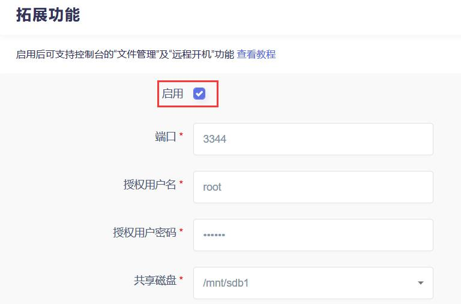  
```
启用：勾选
端口：本机WebDav服务的端口，自行设置，只要不冲突
授权用户名：本机WebDav服务的用户名，自行设置
授权用户密码：本机WebDav服务的用户密码，自行设置
共享磁盘：如果挂载了硬盘，可选硬盘(例如/mnt/sda1)，若没挂载硬盘，选/boot或者/overlay都成

ps：设置共享磁盘的位置，也是本机开启webdav服务后能访问的位置。
```
  
* 回到插件的服务状态，就会看到扩展功能已经启用

    

* 下面开始分别讲解文件管理、WebDav服务、远程开机


## 文件管理

* 远程文件管理支持访问DDNSTO设备所在局域网内的设备的所有的samba、sftp、webdav协议。
  
#### 要使用本功能的先决条件： 

* 开通了会员通道

* 启用ddnsto的拓展功能

* 文件管理目前仅支持PC端的浏览器


#### 如何使用：

* 已经启用了ddnsto拓展功能

* 登录到[DDNSTO控制台](https://www.ddnsto.com/app/#/login)

* 购买会员通道，然后把当前绑定的通道切换成会员通道

  

* 上诉步骤完成后，就能立即添加使用了

  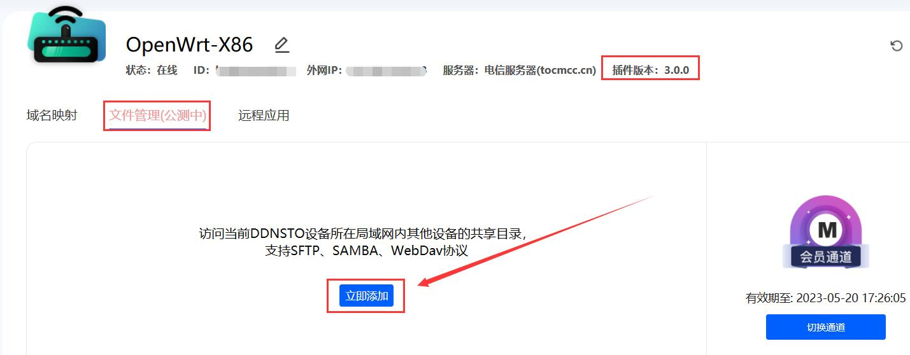

* 目前自动扫码不可用，点击“手动添加”就能出现添加协议的界面

  
 


 
### 1、Samba协议

现在开始添加samba协议。

#### 1.首先确认DDNSTO设备所在局域网内，有设备已经开启了Samba，且能正常访问；

* openwrt系统如何开启samba可参考[教程](https://doc.linkease.com/zh/guide/easepi/common.html#samba共享)；其余设备/系统如何开samba，自行科普，设备/系统太多，不一一举例。

#### 2.然后ddnsto文件管理，添加samba协议；

  

```
类型：选samba

名称：随意，中英文皆可

IP：开启了samba设备的ip

端口：一般默认即可，若自己自定义，需要更改

账号：samba的访问用户名，若没设置，一般是设备系统默认的用户名，比如openwrt是root

密码：samba的访问密码，若没设置，一般是设备系统的登录密码

记住密码：ddnsto不会记录你的密码，若选“不保存”，后面登录的时候需要自行输入，若选“保存至当前浏览器”，设置完成后，你的浏览器会提示保存密码

工作组：一般默认即可，若自己自定义，需要更改

目标路径：samba共享名(不是具体路径，比如电脑文件管理输入 \\192.168.2.2 进入后看到的文件夹名)
```

#### 3.上述参数设置完成后，点击右下角“保存”，会出现数据验证界面，若填写参数没问题，会自动保存。

  

#### 4.关掉添加界面，回到主界面，就看到samba协议已经添加完成。

  

* 若需要继续添加/编辑/删除协议，点击右边的“管理设备”。

* 添加好的samba协议图标，就能直接访问到文件管理，若之前填写参数的时候“记住密码”，选的不保存，会提示需要输入密码。

  
  
  


### 2、sftp协议

现在开始添加sftp协议。

#### 1.首先确认DDNSTO设备所在局域网内，有设备已经开启了sftp，且能正常访问；

#### 2.然后ddnsto文件管理，添加sftp协议；

  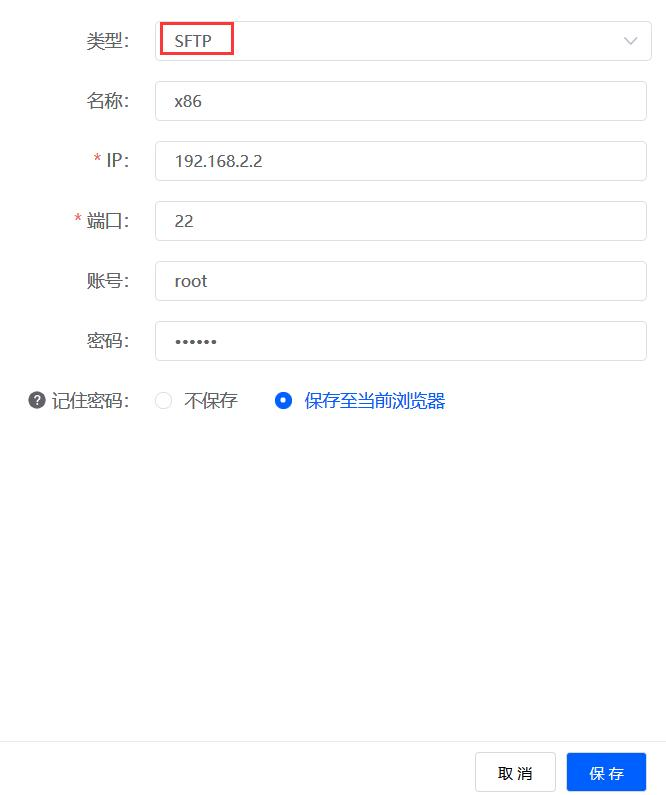

```
类型：选sftp

名称：随意，中英文皆可

IP：开启了sftp设备的ip

端口：一般默认即可，若自己自定义，需要更改

账号：sftp的访问用户名，若没设置，一般是设备系统默认的用户名，比如openwrt是root

密码：sftp的访问密码，若没设置，一般是设备系统的登录密码

记住密码：ddnsto不会记录你的密码，若选“不保存”，后面登录的时候需要自行输入，若选“保存至当前浏览器”，设置完成后，你的浏览器会提示保存密码
```

#### 3.上述参数设置完成后，点击右下角“保存”，会出现数据验证界面，若填写参数没问题，会自动保存。

  

#### 4.关掉添加界面，回到主界面，就看到sftp协议已经添加完成。

  
  
* 若需要继续添加/编辑/删除协议，点击右边的“管理设备”。

* 点击添加好的sftp协议图标，就能直接访问到文件管理，若之前填写参数的时候“记住密码”，选的不保存，会提示需要输入密码。
  
  
  
  


### 3、WebDav协议

现在开始添加webdav协议。

#### 1.首先确认DDNSTO设备所在局域网内，有设备已经开启了webdav，且能正常访问；

#### 2.然后ddnsto文件管理，添加webdav协议；

  

```
类型：选webdav

名称：随意，中英文皆可

URL：开启了webdav设备的ip+端口的完整地址，必须带http://

账号：webdav的访问用户名

密码：webdav的访问密码

记住密码：ddnsto不会记录你的密码，若选“不保存”，后面登录的时候需要自行输入，若选“保存至当前浏览器”，设置完成后，你的浏览器会提示保存密码
```

#### 3.上述参数设置完成后，点击右下角“保存”，会出现数据验证界面，若填写参数没问题，会自动保存。

  
  
#### 4.关掉添加界面，回到主界面，就看到webdav协议已经添加完成。

  
  
* 若需要继续添加/编辑/删除协议，点击右边的“管理设备”。

* 点击添加好的webdav协议图标，就能直接访问到文件管理，若之前填写参数的时候“记住密码”，选的不保存，会提示需要输入密码。
 
  
  
  
  

  
  
## 本机WebDav服务

* WebDav服务是在本机启用webdav服务，方便局域网内其他webdav客户端访问本机。

#### 如何使用：

* 已经启用了ddnsto拓展功能

   

```
设置共享磁盘的位置，也是本机开启webdav服务后，局域网内其他webdav客户端能访问的位置。
想把哪个盘共享出去，就写哪个盘的挂载点，比如/mnt/sdb1。
``` 
  
* 如图设置好以后，其他webdav客户端就能访问了，比如浏览器直接输入 `http://192.168.2.2:3344/webdav`  

   
  
    
  
  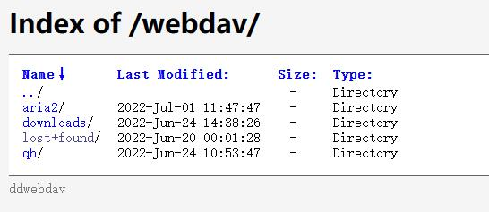    
  
  
  

## 远程开机

* 启用拓展功能后，配合远程应用里的“远程开机”，可实现电脑远程开机。

#### 如何使用：

* 已经启用了ddnsto[拓展功能](https://doc.linkease.com/zh/guide/ddnsto/ddnstofile.html)，并记录授权用户名和授权用户密码(后面要用)

  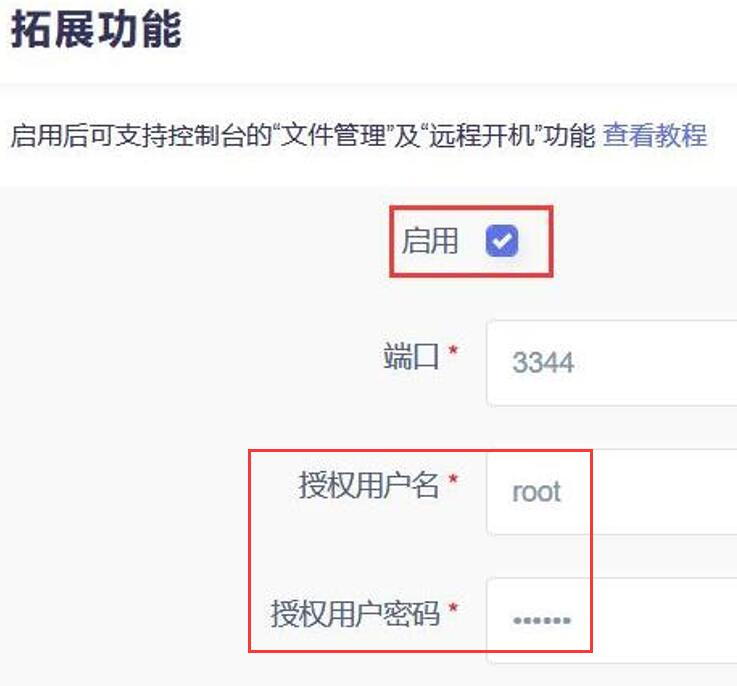 

* 电脑(台式机/笔记本)必须通过网线连接到ddnsto所在的网络

* 电脑的主板BIOS里启用“网络唤醒”
```
BIOS -> Advanced -> Device Options -> Wake on LAN -> 选择Enable

或者

BIOS -> 高级 -> 高级电源管理(APM) -> 由PCI-E设备唤醒 -> 选择Enable
```
不同的主板对Wake on LAN功能的称呼不同，比如可能会叫`由PCI-E设备唤醒`、`Power On By PCI-E`、`Resume By LAN`、`Enable Wake ON LAN`、`Wake on LAN`等等。电脑主板种类繁多，自行查阅资料。

  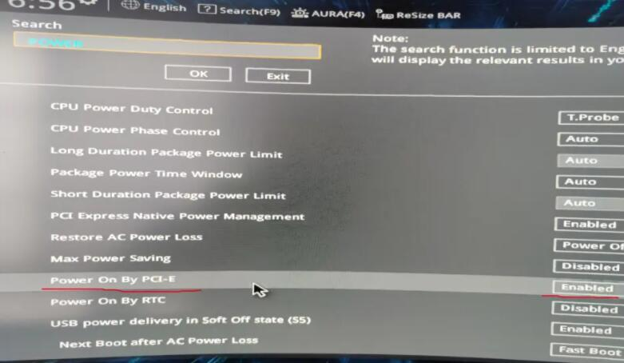 

  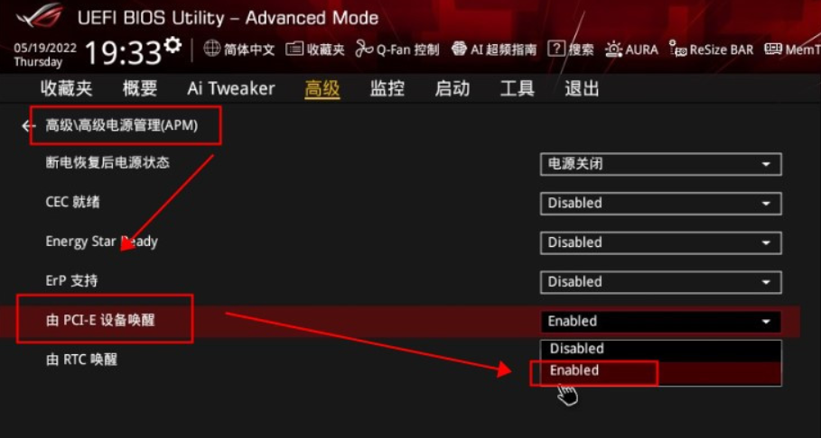 

* 电脑设置：取消“快速启动”
```
控制面板->系统和安全->电源选项->左侧 选择电源按钮的功能->关机设置->取消勾选“启用快速启动(推荐)”
```	
   

  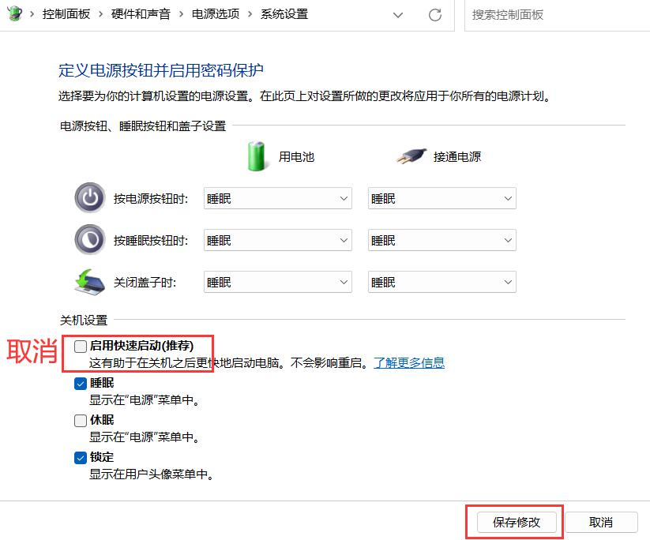 
  
如果无法取消勾选，先点页面上部的`更改当前不可用设置`，即可修改。

   
  
* 电脑设置：设置“网卡唤醒”
```  
控制面板->硬件和声音->设备管理器->点开网络适配器->会显示网卡
网卡一般会显示品牌，例如：Inter、Realtek等
```
   

  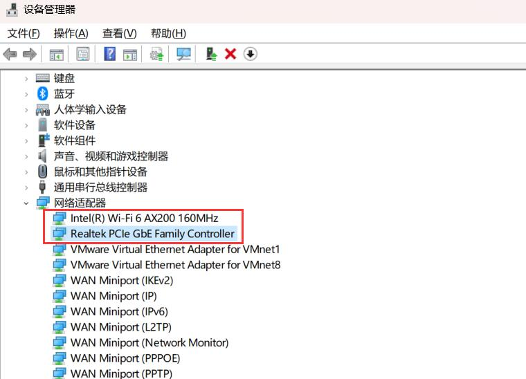

```  
双击网卡名称->电源管理：
勾选“允许计算机关闭此设备以节约电源”，“允许此设备唤醒计算机”和“只允许魔幻数据包唤醒计算机”
```
特别注意：若有多块网卡(不管是有线还是无线)都需要这么设置，否则有可能无法远程唤醒。 
 
  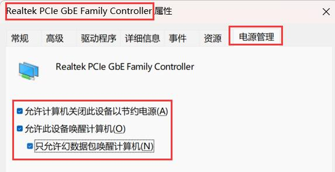   
 
  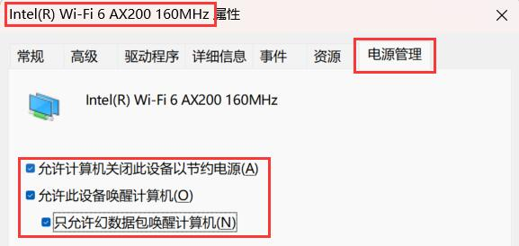   
  
* 电脑设置：找到联网网卡的物理地址(mac地址)
```
控制面板->网络和Internet->网络和共享中心->查看活动网络->连接->详细信息->物理地址
```
     
 
  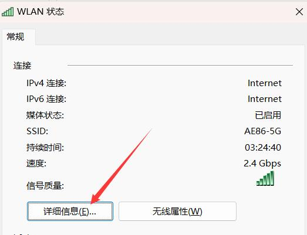   

  

在“网络连接详细信息”页面，直接`ctrl+c`能复制整页信息，然后粘贴到文本里，找出物理地址备用。
```
物理地址：xx-xx-xx-xx-xx-xx，然后把地址中间的间隔符-改成英文冒号，让地址变成：xx:xx:xx:xx:xx:xx。
```
 
* 登录到[DDNSTO控制台](https://www.ddnsto.com/app/#/login) -> 远程应用 -> 添加远程开机

  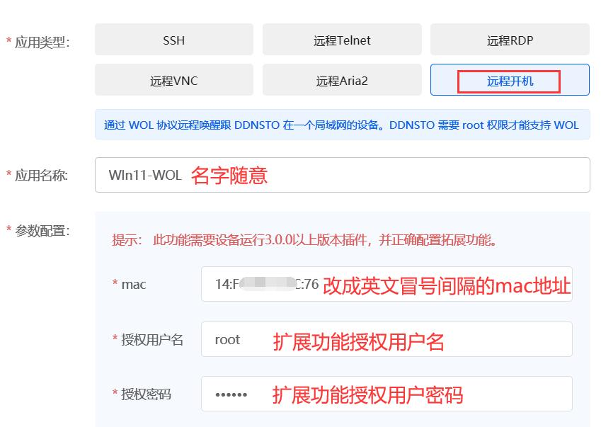   

* 添加完成后，把要远程开机的电脑关机，然后用另外的设备登录ddnsto控制台，点击“远程开机”图标，即可对电脑发送开机指令
  
  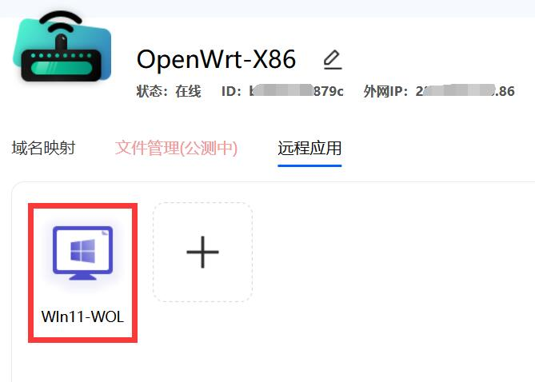
  
    