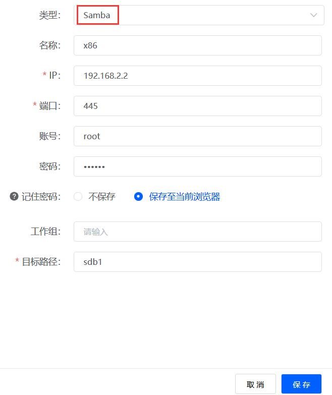

## 文件管理

DDNSTO远程文件管理上线。仅针对高级通道才能使用。

* 目前内部测试中，静待发布！

远程文件管理支持访问DDNSTO设备所在局域网内的设备的所有的samba、sftp、webdav协议。

  
  
#### 要使用本功能的先决条件： 

* 开通了高级通道

* 路由器等设备上的ddnsto已经更新到0.3.1及以上

* 目前仅支持PC端的浏览器

#### 如何使用：

* 登录到[DDNSTO控制台](https://www.ddnsto.com/app/#/login)

* 购买高级通道

  
  
* 已经升级了ddnsto到0.3.1及以上，然后把当前绑定的通道切换成高级通道

  

* 上诉步骤完成后，就能立即添加使用了

  

目前自动扫码不可用，点击“手动添加”就能出现添加协议的界面

  
  
### Samba

现在开始添加samba协议。

#### 1.首先确认DDNSTO设备所在局域网内，有设备已经开启了Samba，且能正常访问；

* openwrt系统如何开启samba可参考[教程](https://doc.linkease.com/zh/guide/easepi/common.html#samba共享)；其余设备/系统如何开samba，自行科普，设备/系统太多，不一一举例。

#### 2.然后ddnsto文件管理，添加samba协议；

  

```
类型：选samba

名称：随意，中英文皆可

IP：开启了samba设备的ip

端口：一般默认即可，若自己自定义，需要更改

账号：samba的访问用户名，若没设置，一般是设备系统默认的用户名，比如openwrt是root

密码：samba的访问密码，若没设置，一般是设备系统的登录密码

记住密码：ddnsto不会记录你的密码，若选“不保存”，后面登录的时候需要自行输入，若选“保存至当前浏览器”，设置完成后，你的浏览器会提示保存密码

工作组：一般默认即可，若自己自定义，需要更改

目标路径：samba共享名

公网WebDav：把当前的的samba协议转成公网的webdav，可直接用webdav客户端访问(后面教程具体说这个功能)
```

#### 3.上述参数设置完成后，点击右下角“保存”，会出现数据验证界面，若填写参数没问题，就直接保存了。

  

#### 4.关掉添加界面，回到主界面，就看到samba协议已经添加完成。

  

* 若需要继续添加/编辑/删除协议，点击右边的“管理设备”。

* 添加好的samba协议图标，就能直接访问到文件管理，若之前填写参数的时候“记住密码”，选的不保存，会提示需要输入密码。

  
  
  


### sftp

现在开始添加sftp协议。

#### 1.首先确认DDNSTO设备所在局域网内，有设备已经开启了sftp，且能正常访问；

#### 2.然后ddnsto文件管理，添加sftp协议；

  

```
类型：选sftp

名称：随意，中英文皆可

IP：开启了sftp设备的ip

端口：一般默认即可，若自己自定义，需要更改

账号：sftp的访问用户名，若没设置，一般是设备系统默认的用户名，比如openwrt是root

密码：sftp的访问密码，若没设置，一般是设备系统的登录密码

记住密码：ddnsto不会记录你的密码，若选“不保存”，后面登录的时候需要自行输入，若选“保存至当前浏览器”，设置完成后，你的浏览器会提示保存密码

公网WebDav：把当前的的sftp协议转成公网的webdav，可直接用webdav客户端访问(后面教程具体说这个功能)
```

#### 3.上述参数设置完成后，点击右下角“保存”，会出现数据验证界面，若填写参数没问题，就直接保存了。

  

#### 4.关掉添加界面，回到主界面，就看到sftp协议已经添加完成。

  
  
* 若需要继续添加/编辑/删除协议，点击右边的“管理设备”。

* 点击添加好的sftp协议图标，就能直接访问到文件管理，若之前填写参数的时候“记住密码”，选的不保存，会提示需要输入密码。
  
  
  
  


### WebDav

现在开始添加webdav协议。

#### 1.首先确认DDNSTO设备所在局域网内，有设备已经开启了webdav，且能正常访问；

#### 2.然后ddnsto文件管理，添加webdav协议；

  

```
类型：选webdav

名称：随意，中英文皆可

URL：开启了webdav设备的ip+端口的完整地址，必须带http://

账号：webdav的访问用户名

密码：webdav的访问密码

记住密码：ddnsto不会记录你的密码，若选“不保存”，后面登录的时候需要自行输入，若选“保存至当前浏览器”，设置完成后，你的浏览器会提示保存密码

公网WebDav：把当前的的webdav协议转成公网的webdav，可直接用webdav客户端访问(后面教程具体说这个功能)
```

#### 3.上述参数设置完成后，点击右下角“保存”，会出现数据验证界面，若填写参数没问题，就直接保存了。

  
  
#### 4.关掉添加界面，回到主界面，就看到webdav协议已经添加完成。

  
  
* 若需要继续添加/编辑/删除协议，点击右边的“管理设备”。

* 点击添加好的webdav协议图标，就能直接访问到文件管理，若之前填写参数的时候“记住密码”，选的不保存，会提示需要输入密码。
 
  
  
  
  
  
## 公网WebDav

公网WebDav是可以把添加的samba/sftp/webdav协议转成公网webdav，利用各种webdav客户端，可以直接访问(外网也可以，目前不需要验证ddnsto)。

#### 如何使用？

* 上述添加samba/sftp/webdav协议过程中，勾选了“公网WebDav”选项，保存即可；

  
  
* 回到主界面，添加的协议图标下，会出现公网WebDav链接，点击右边的小图标即可复制链接。

* 此链接放到浏览器地址栏无用，必须是支持webdav协议访问的客户端。

  
  
* 然后利用webdav客户端，通过复制的链接即可访问。


