## 获取Token

1. 打开[DDNSTO官网](https://www.ddnsto.com/)，点击右上角[控制台](https://www.ddnsto.com/app/#/login)，微信扫码登录。

   

2. 登录成功后，复制右上角令牌(Token)。

   

## 安装DDNSTO 

### 1. EasePi

EasePi固件“iStore”应用商店，已默认安装DDNSTO，直接就可使用。


打开服务中的DDNSTO，勾选“启用”并填入令牌，保存并应用。


### 2. iStoreOS

iStoreOS固件自带“iStore”应用商店，直接在商店里安装DDNSTO。


打开服务中的DDNSTO，勾选“启用”并填入令牌，保存并应用。


### 3. KS梅林固件
   KS梅林固件，在软件中心搜索并安装ddnsto插件。

   

   安装后开启并设置token。

   

### 4. KS LEDE固件  
   * KS LEDE v2.3.7及以下版本固件，在酷软中心搜索并安装ddnsto插件。

   
   
   安装后开启并设置token。
   
   

   * KS LEDE v3.2及以上版本固件，通过iStore商店安装ddnsto插件。

   1.首先在系统——软件包里，搜索ddnsto，并卸载自带的ddnsto；

   2.然后进入iStore——维护，把iStore商店升级为最新，然后在iStore里安装ddnsto。   
 
    
   
   
### 5. OpenWrt固件 
   OpenWrt固件开发者众多，部分固件不自带ddnsto，可通过以下任一脚本轻松安装：

   via curl
```
sh -c "$(curl -sSL http://fw.koolcenter.com/binary/ddnsto/openwrt/install_ddnsto.sh)"
```
   via wget
```
sh -c "$(wget --no-check-certificate -qO- http://fw.koolcenter.com/binary/ddnsto/openwrt/install_ddnsto.sh)"
```
   others
```
cd /tmp; wget --no-check-certificate http://fw.koolcenter.com/binary/ddnsto/openwrt/install_ddnsto.sh; sh ./install_ddnsto.sh
```
   在OpenWrt TTYD终端中输入任一上述命令，会自动安装完成。

   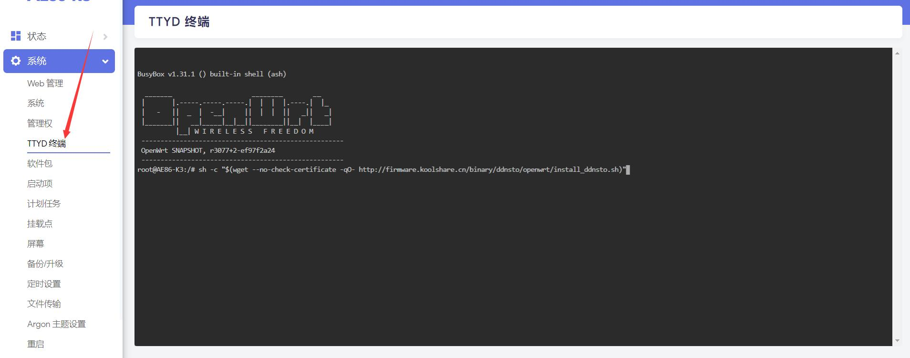
   
   

   或者putty、MobaXterm等软件登陆SSH，输入任一上述命令，会自动安装完成。

   
   
   
 
    

   然后找到DDNS.to内网穿透，启用并设置token。

    

#### Openwrt 常见问题解决思路

  *安装好ddnsto之后无法启用配置

  因为 Openwrt 15 版本跟最新的插件不兼容导致，解决办法尝试一：

  ```
  /etc/init.d/ddnsto disable
  /etc/init.d/ddnsto enable
  ```
  
  如果不行则尝试二：重启路由器

  
  
### 6. 群晖固件 

   1.下载对应自己版本的 [synology插件](https://fw.koolcenter.com/binary/ddnsto/synology/)并上传安装；
  
  * 请根据自己群晖的CPU型号以及DSM版本选择相对应的插件(DSM7.x用户，请先卸载旧版ddnsto套件)

   

   2.填入刚刚从官网复制的令牌(Token)，点击下一步完成安装；

   

   3.即可在面板看到ddnsto(ddnsto官网的快速访问链接)。

   
   
   * 若群晖发生下图错误，则必须通过docker安装。
         
   

   * Docker安装可以参考下面的[Unraid/爱快/Docker教程](/zh/guide/ddnsto/koolshare_merlin.html#_8-unraid-爱快-铁威马-docker)。

   * 群晖系统不要将 “自动将DSM桌面的HTTP连接重定向到HTTPS” 打开。

   DSM6：
   
   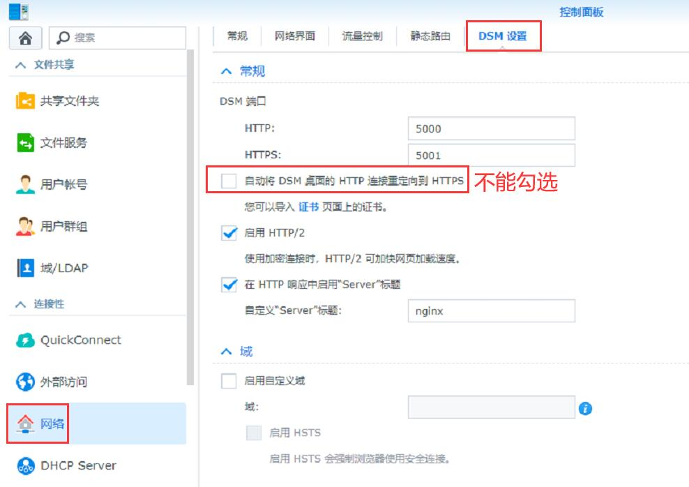

   DSM7：
   
	
	
 
### 7. 威联通

  1.下载对应自己版本的 [QNAP插件](https://fw.koolcenter.com/binary/ddnsto/qnap/)进行手动安装；

  * 如果不知道自己的平台，一般来说是 DDNSTO_xxx_x86_64.qpkg

   
   
  * 若遇到安装失败，日志如图：
  
   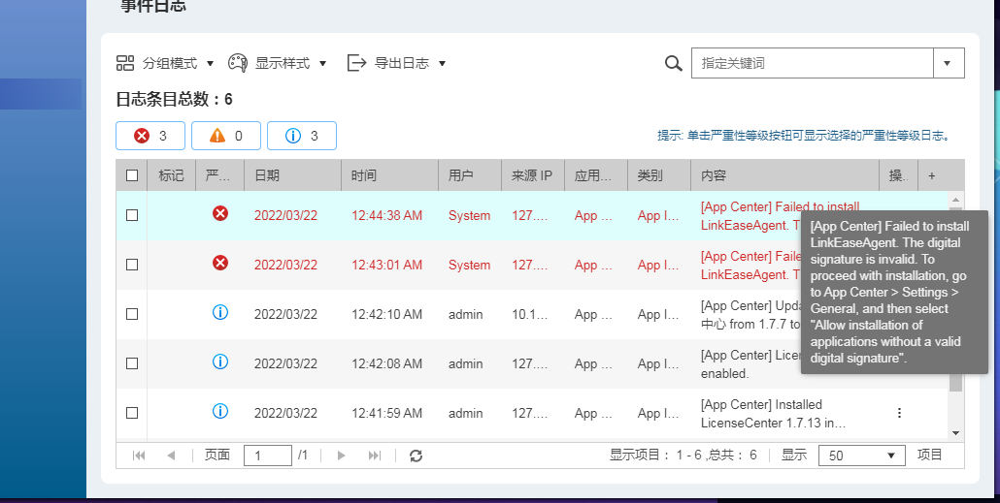
     
  则如图开启允许未签名即可。
  
    

  2.安装好了，要配置：TOKEN从官网拿，填入提交就可以了，然后回到官网去配置域名。

  * QNAP的域名端口是8080，比如配置内网地址为：http://127.0.0.1:8080。
  
  * **威联通升级新系统后，DDNSTO更换过TOKEN后，需要停用插件后重新开启。**

   

  * **如果安装失败，或者无法配置，请开启 WEB服务，并且取消勾选HTTPS(若之前勾选过，请卸载重装ddnsto)。**

   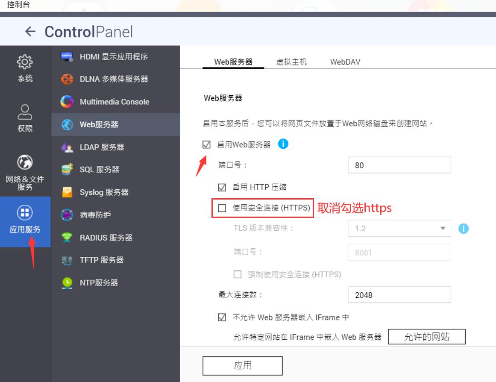  
   
### 8. Unraid/爱快/铁威马/Docker

**Docker方式安装ddnsto，包括并不限于Unraid/爱快/群晖等，只要有Docker的设备都成，一些Linux发行版等。**

* 铁威马：首先在应用中心里安装Docker(TOS 4.0及更高的系统)，然后在控制面板——终端与SNMP——启用SSH访问。然后电脑利用putty、xshell等工具登录终端，然后输入“sudo -i”和密码获取临时ROOT权限，然后进行下面的教程。

* 群晖：在控制面板——终端机与SNMP——启用SSH访问。然后电脑利用putty、xshell等工具登录终端，然后输入“sudo -i”和密码获取临时ROOT权限，然后进行下面的教程。

* Linux发行版：某些Linux系统可能默认不自带Docker，那么就需要终端命令安装Docker：

```
首先执行：curl -sSL https://get.docker.com/ | sh

上一条命令执行完毕后，执行：sudo chmod 777 /var/run/docker.sock
```
Docker安装完成后，进行下面的教程。


**Docker安装ddnsto教程开始：**

**终端运行以下命令：(先不要直接复制，看下面的说明)**
```
docker run -d \
    --name=ddnsto \
    --restart always \
	--network host \
    -e TOKEN=<填入你的token> \
    -e DEVICE_IDX=<默认0，如果设备ID重复则为1-100之间> \
    -v /etc/localtime:/etc/localtime:ro \
    -e PUID=<uid for user> \
    -e PGID=<gid for user> \
    linkease/ddnsto
```

1. <填入你的token>: 填写从ddnsto控制台拿到的 token。
2. DEVICE_IDX: 默认0，如果设备ID重复则改为1-100之间。
3. PUID/PGID：获取方式：终端输入id即可。

   
   
比如上图获取的UID和GID都是0。
   
4.注意要替换 "<>" 里面的内容，且不能出现 "<>"。

5.准备工作做好了，比如我的TOKEN为abcdefg-8888-8888-1111-abcdefghijk，那我的终端命令就是：
```
docker run -d \
    --name=ddnsto \
    --restart always \
	--network host \
    -e TOKEN=abcdefg-8888-8888-1111-abcdefghijk \
    -e DEVICE_IDX=0 \
    -v /etc/localtime:/etc/localtime:ro \
    -e PUID=0 \
    -e PGID=0 \
    linkease/ddnsto
```

6.Docker在某些Linux发行版，可能要加上“sudo”前缀才能运行，按提示输入Linux的密码，命令如下：

```
sudo docker run -d \
    --name=ddnsto \
    --restart always \
	--network host \
    -e TOKEN=abcdefg-8888-8888-1111-abcdefghijk \
    -e DEVICE_IDX=0 \
    -v /etc/localtime:/etc/localtime:ro \
    -e PUID=0 \
    -e PGID=0 \
    linkease/ddnsto
```

#### Docker常见问题

* Docker里面的网关设置，不能为路由器的网关，保证 Docker 里面有网络才能访问 ddnsto 服务器。

[镜像地址](https://hub.docker.com/r/linkease/ddnsto/)

* 若群晖用docker安装，建议去Docker管理器里，先停用ddnsto容器，然后编辑，开启`使用高权限执行容器`和`启用自动重新启动`，保存应用。

   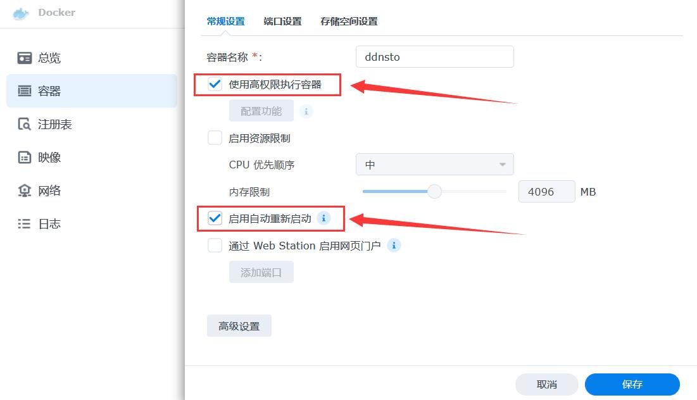


#### Unraid实战ddnsto

Unraid也能远程穿透，使用ddnsto超级简单：

1.首先，登录Unraid的管理界面，点击docker，然后右上方有个终端的按钮，点击进去。

   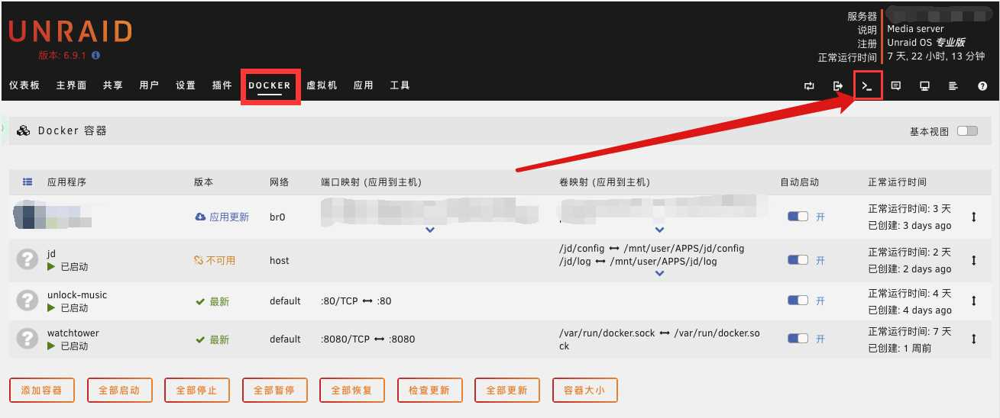
   
2.进入终端后，输入上面提到的命令：

```
docker run -d \
    --name=ddnsto \
    --restart always \
    --network host \
    -e TOKEN=b5xxxxxxxxxx26622 \
    -e DEVICE_IDX=0 \
    -v /etc/localtime:/etc/localtime:ro \
    -e PUID=0 \
    -e PGID=0 \
    linkease/ddnsto:latest
```
   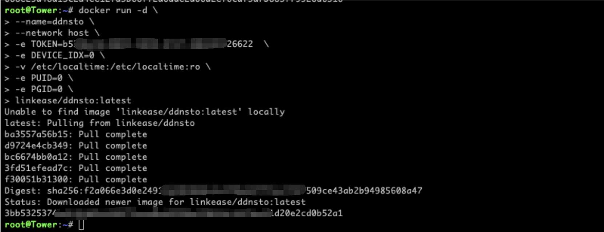
  
3.上面终端执行完成后，就成功安装ddnsto。(建议启用开机启动) 
 
   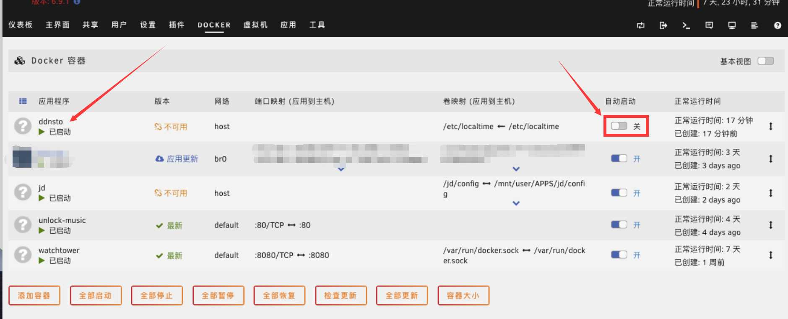
 
4. 然后ddnsto主页添加域名映射即可，注意Unraid的端口别写错。

   

### 9. 老毛子Padavan
   * 扩展功能—花生壳内网，然后右侧选择ddnsto，启用并设置token。
   
   * 并不是所有的Padavan固件都会带ddnsto，这个要看固件作者是否加入ddnsto。

   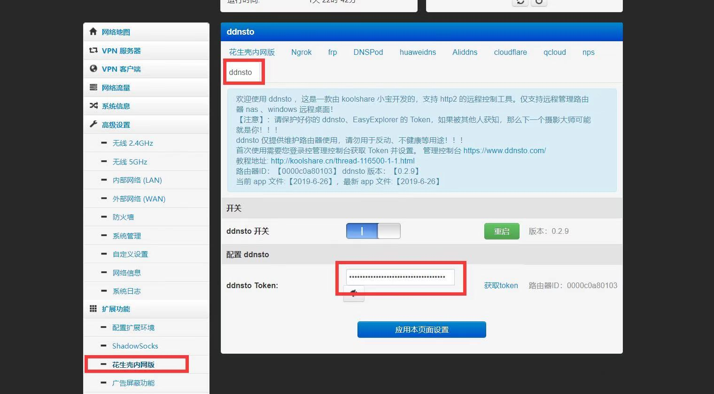

#### Padavan 常见问题

  * 若Padavan内置二进制版本 < 0.2.9版本，可能导致重启后ddnsto 无法用，需自己[更新二进制](https://fw.koolcenter.com/binary/ddnsto/mipsel/ddnsto)。

  这个问题还无法联系开发者更换最新版本。

### 10. ReadyNAS

* 支持以下ReadyNAS存储设备：

| [ARM设备] | [x86设备] |[x86设备]  |
| --------         |------|-----|
| ReadyNAS 102        | ReadyNAS 312        | ReadyNAS 626X        |
| ReadyNAS 104        | ReadyNAS 314        | ReadyNAS 628X        |
| ReadyNAS 202        | ReadyNAS 316        | ReadyNAS 716X        |
| ReadyNAS 204        | ReadyNAS 422        | ReadyNAS 2304        |
| ReadyNAS 212        | ReadyNAS 424        | ReadyNAS 2312        |
| ReadyNAS 214        | ReadyNAS 426        | ReadyNAS 3130        |
| ReadyNAS 2120       | ReadyNAS 428        | ReadyNAS 3138        |
|        -            | ReadyNAS 516        | ReadyNAS 3220        |
|        -            | ReadyNAS 524X        | ReadyNAS 4220        |
|        -            | ReadyNAS 526X        | ReadyNAS 3312        |
|        -            | ReadyNAS 528X        | ReadyNAS 4312        |

#### 安装程序
* 1， [下载](https://fw.koolcenter.com/binary/ddnsto/readynas/ddnsto_all.deb)以 **.deb** 结尾的安装程序
* 2， 进入ReadyNAS管理界面，点进 **应用程序**
* 3， 选择上传并安装应用程序

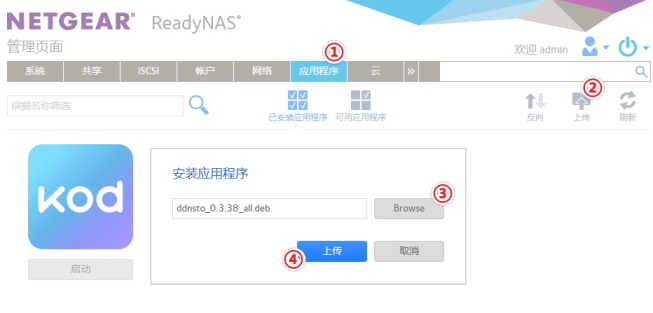


   
## 穿透设置

   回到ddnsto.com控制台，刷新等待设备出现在界面上。如长时间没有出现请查看【常见问题】！

   

## 添加域名

1. 用户中心出现设备后，点击添加域名映射"+"。

   

2. 添加域名前缀，请使用小写字母或数字，并且大于6个字符。如前缀是"kool666666"，那么访问路由器的地址就是https://kool666666.ddnsto.com:443 ,在目标主机一栏填入路由器LAN口IP地址，如http://192.168.50.1:80 ( 端口如果是80，可以省略端口如：http://192.168.50.1 。非80端口则不能省略，如http://192.168.50.11:5000 ，请根据实际情况填写！)，填写完毕后点击"添加"。

   

   提交后可以看到完整的访问地址"https://kool666666.ddnsto.com:443"已经录入了！

   


**群晖穿透设置有点不一样：**

假如我群晖主机IP是http://127.0.0.1/，那就后面就加个5000端口，那么就是http://127.0.0.1:5000/；

* 群晖若遇到IP+5000端口穿透不过去的，建议改成http://127.0.0.1:5000/

  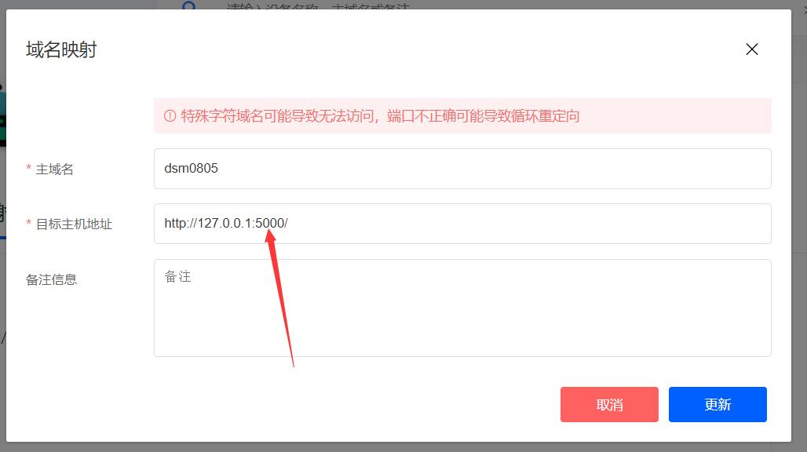 

这样设置成功，访问域名就能正常访问NAS了。
  
   
  
  

3. 成功添加后请稍等1分钟左右即可正常访问。如果提交后立刻访问，可能会看到下面的错误页面，此时插件还正在重启。

   

4. 通过访问绑定的域名即可访问路由器，首次访问可能需要微信登录验证。

   


补充几种特殊设置说明：

- merlin shellinabox插件设置

  shellinabox插件域名前缀的格式是固定的，是在你路由器的域名前缀后面添加“-cmd”，映射地址填路由器LAN口IP加端口4200。像我们前面设置的路由器前缀是kool666666，则shellinabox插件域名前缀就是“kool666666-cmd”，目标主机地址为http://192.168.50.1:4200

  

  

  成功！

  

  
  
## 设备改名

绑定了ddnsto的设备，可随意改名：

1.进入控制台后，“设备”里点击“笔”图标； 
  
  

2.出来的弹窗，填写自己喜欢的名字即可。
 
 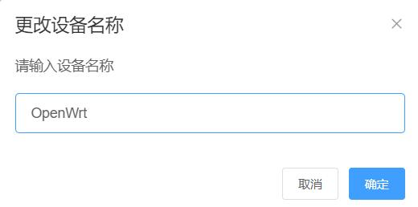  
 
 
  
## 通道和服务器

为了ddnsto更健康的发展，需要大家多多支持！现推出了26元/年的通道，每个通道可以绑定一台设备。

  

同时我们也增加了新的服务器以满足更多用户的稳定使用。

  
  
  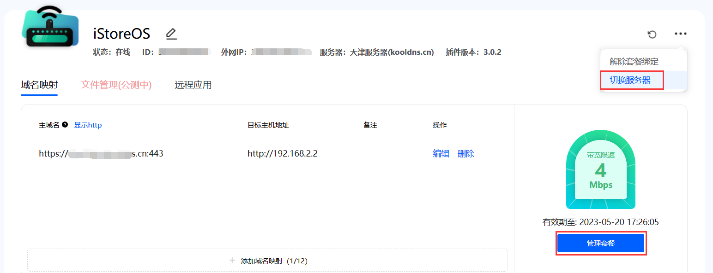

切换服务器后，有几点需要注意的：

- 域名前缀也会随之改变，如现在除了原有的"ddnsto.com",还多了"kooldns.cn"
- 切换通道后ddnsto插件会有1分钟左右的初始化时间，期间绑定的域名会不可用，请稍等再尝试
- 切换后原有的域名将不可使用，如"aaa.kooldns.cn"切换到了"aaa.ddnsto.com"之后，原有的"aaa.koolddns.cn"将不可使用。

