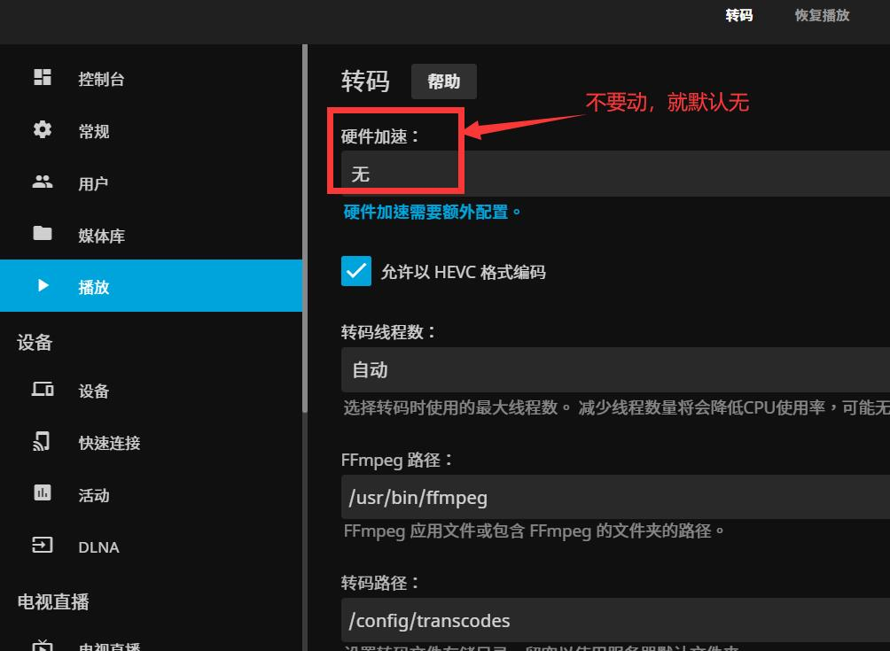
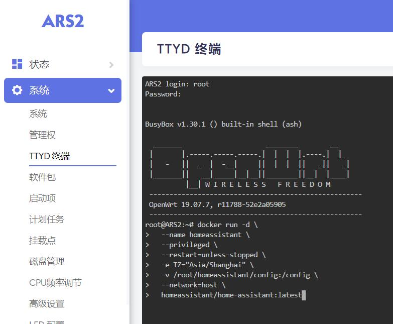
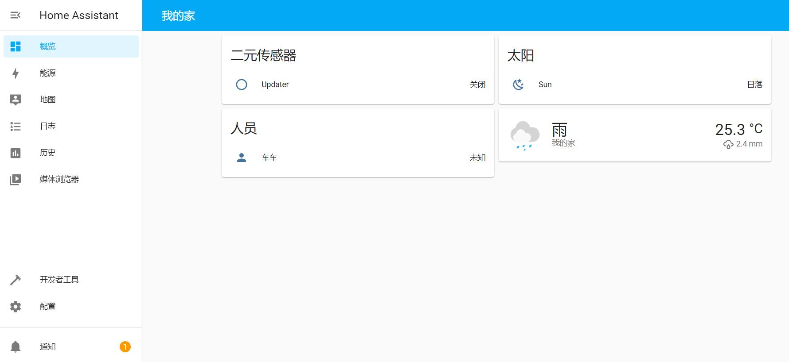
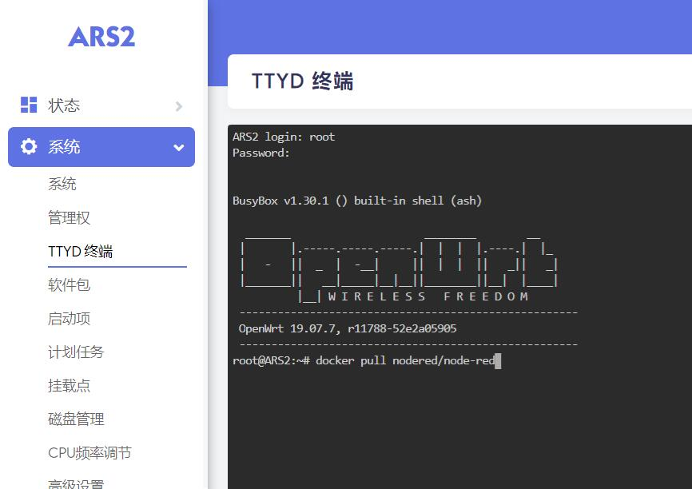
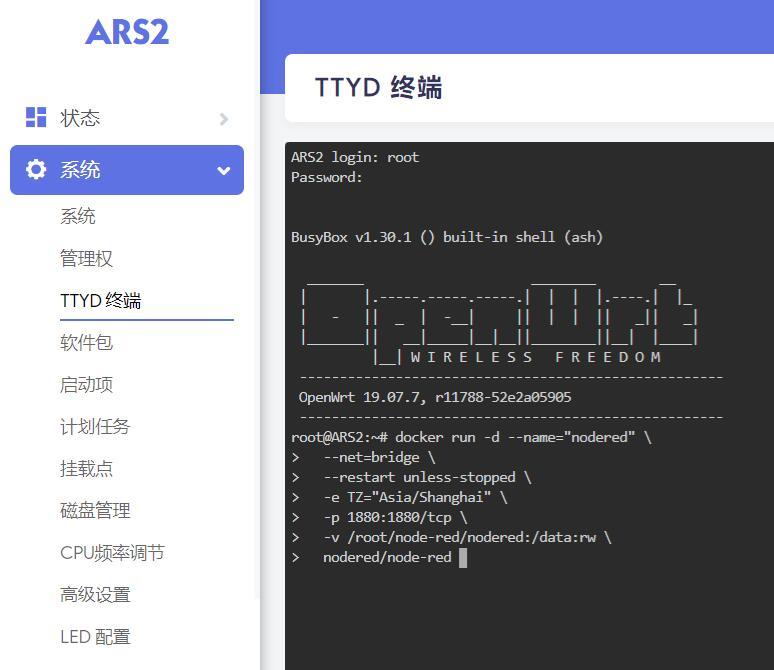
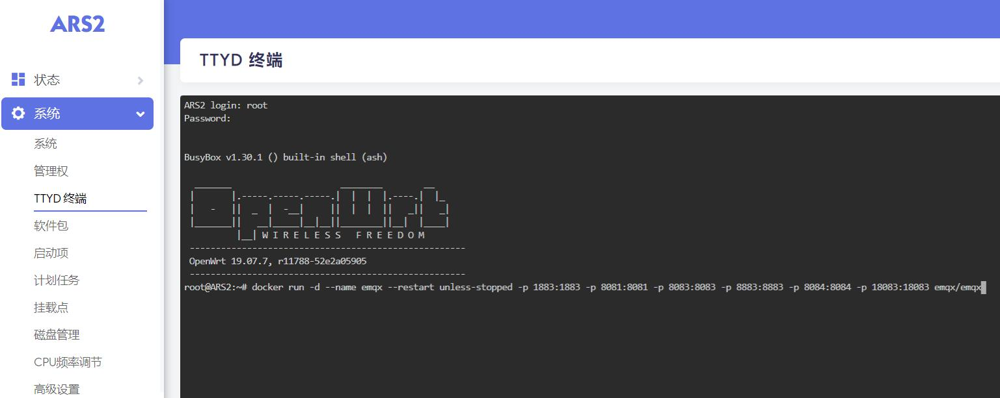
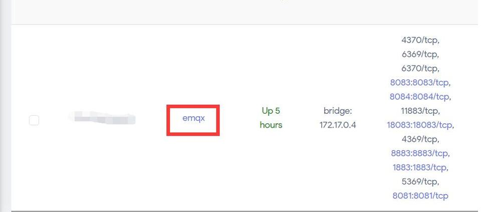
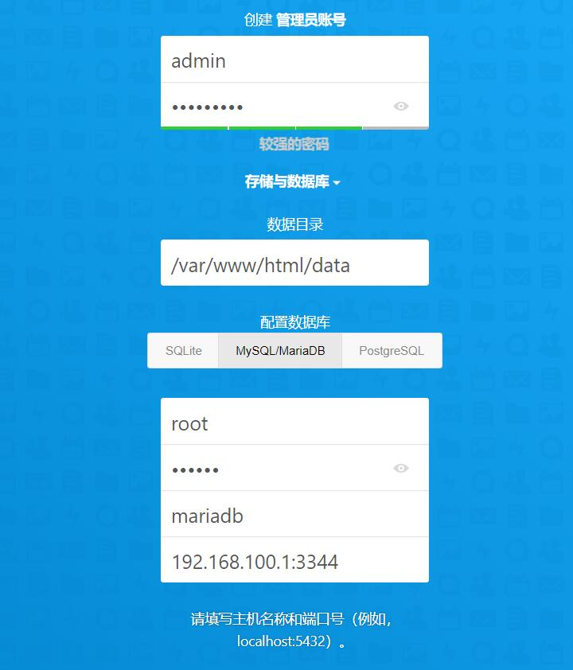
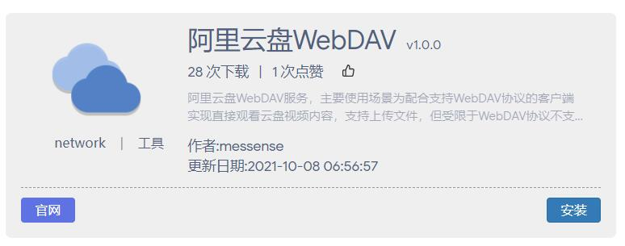
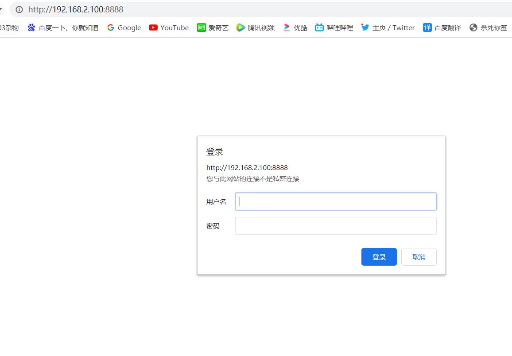

## 混杂模式MACVLAN
Linux原始的macvlan没有混杂模式，打开混杂模式也会过滤掉不是发给自己的报文。

ARS2的内核改变了这个行为，混杂模式的macvlan可以接收到宿主接口的所有报文，除了单播给宿主接口的报文。

应用场景：使用混杂模式macvlan，将WAN口的报文转发到一个网桥中，加入此网桥的虚拟网卡即可加入宿主机WAN口所在的局域网，获得局域网IP。以Docker为例：

```
HOST_WAN=eth0

ip link add macv-docker-wan link $HOST_WAN type macvlan mode private
ip link set dev macv-docker-wan promisc on

ip link add br-docker-wan type bridge

ip link set dev macv-docker-wan master br-docker-wan
ip link set dev macv-docker-wan up

docker network ls -f "name=docker-wan" | grep -q docker-wan || \
    docker network create -d bridge -o "com.docker.network.bridge.name=br-docker-wan" docker-wan

echo "0" > /proc/sys/net/bridge/bridge-nf-call-iptables
```

创建容器并加入docker-wan网络：
```
docker run --net=docker-wan debian
```

Docker会给容器分配IP，但这里用不上，容器内执行以下命令获得局域网IP：
```
ip addr flush dev eth0 && udhcpc
```


## Jellyfin硬解

Jellyfin是一个优秀的家庭影院平台，而ARS2支持4K H265（HEVC），H264等格式硬解，这样我们就可以把ARS2打造成您的私人家庭影院。

#### 1.ARS2上安装硬盘，或者移动硬盘；

#### 2.进入ARS2的管理界面—系统—挂载点，挂载好硬盘，记住路径；


#### 3.Docker拉取Jellyfin镜像，进入终端，输入下面的命令并回车运行;
```
docker pull jjm2473/jellyfin-rtk:v10.7
```


#### 4.接着继续输入如下命令并回车运行，创建Jellyfin容器(先别直接复制输入，下方有说明)；
```
docker run --restart=unless-stopped -d \
     --device /dev/rpc0:/dev/rpc0 \
     --device /dev/rpc1:/dev/rpc1 \
     --device /dev/rpc2:/dev/rpc2 \
     --device /dev/rpc3:/dev/rpc3 \
     --device /dev/rpc4:/dev/rpc4 \
     --device /dev/rpc5:/dev/rpc5 \
     --device /dev/rpc6:/dev/rpc6 \
     --device /dev/rpc7:/dev/rpc7 \
     --device /dev/rpc100:/dev/rpc100 \
     --device /dev/uio250:/dev/uio250 \
     --device /dev/uio251:/dev/uio251 \
     --device /dev/uio252:/dev/uio252 \
     --device /dev/uio253:/dev/uio253 \
     --device /dev/ion:/dev/ion \
     --device /dev/ve3:/dev/ve3 \
     --device /dev/vpu:/dev/vpu \
     --device /dev/memalloc:/dev/memalloc \
     -v /tmp/shm:/dev/shm \
     -v /sys/class/uio:/sys/class/uio \
     -v /var/tmp/vowb:/var/tmp/vowb \
     --pid=host \
     --dns=172.17.0.1 \
     -p 8096:8096 -v /root/jellyfin/config:/config -v /mnt/sda3/media:/media --name myjellyfin-rtk-10.7 jjm2473/jellyfin-rtk:v10.7
```

**说明：**

/root/jellyfin/config 用来存放Jellyfin的配置以及转码的临时文件，按需修改。

/mnt/sda3/media 表示媒体文件所在路径，改成自己挂载硬盘的媒体路径，按需修改。


#### 5.上面2条命令完成以后，管理界面—Docker—容器，就能看到Jellyfin已经运行起来了；


#### 6.浏览器打开设备对应IP加上8096端口，例如http://192.168.100.1:8096/，即可进入Jellyfin视界。


#### 7.进入Jellyfin视界后，不要去动硬件加速。

#### 因为docker镜像和创建容器命令中已经配置好硬解，所以千万不要去动这个硬件加速设置。




## Home Assistant

一款优秀的家庭自动化平台，您的智能家居好帮手。

#### 1.Docker拉取homeassistant镜像，进入终端，输入下面的命令并回车运行;
```
docker pull homeassistant/home-assistant:latest
```


#### 2.接着继续输入如下命令并回车运行，创建homeassistant容器(先别直接复制输入，下方有说明)；
```
docker run -d \
  --name homeassistant \
  --privileged \
  --restart=unless-stopped \
  -e TZ="Asia/Shanghai" \
  -v /root/homeassistant/config:/config \
  --network=host \
  homeassistant/home-assistant:latest
```

**说明：**

/root/homeassistant/config 用来存放homeassistant的配置文件，按需修改。



#### 3.上面2条命令完成以后，管理界面—Docker—容器，就能看到homeassistant已经运行起来了；


#### 4.浏览器打开设备对应IP加上8123端口，例如http://192.168.100.1:8123/，即可进入homeassistant控制台。




## Node-RED

Node-RED，这个项目是由IBM新兴技术服务团队构建的可视化物联网编排工具，可基于浏览器的流程编辑器连接设备、服务器和API应用。可以将Home Assistant接入Node-Red实现自动化。

#### 1.Docker拉取node-red镜像，进入终端，输入下面的命令并回车运行;
```
docker pull nodered/node-red
```


#### 2.接着继续输入如下命令并回车运行，创建node-red容器(先别直接复制输入，下方有说明)；
```
docker run -d --name="nodered" \
  --net=bridge \
  --restart unless-stopped \
  -e TZ="Asia/Shanghai" \
  -p 1880:1880/tcp \
  -v /root/node-red/nodered:/data:rw \
  nodered/node-red
```

**说明：**

/root/node-red/nodered 用来存放node-red的数据文件，按需修改。



#### 3.接着输入以下命令(解决node-red容器启动不了的bug)；

```
chmod -R 777 /root/node-red/nodered
```


#### 4.上面3条命令完成以后，管理界面—Docker—容器，找到node-red重启，然后node-red就运行起来了；


#### 5.浏览器打开设备对应IP加上1880端口，例如http://192.168.100.1:1880/，即可进入node-red控制台。


## MQTT-EMQX

EMQX基于Erlang/OTP平台开发的MQTT消息服务器，是开源社区中最流行的MQTT 消息服务器，支持丰富的物联网协议，包括 MQTT、LwM2M、MQTT-SN、CoAP、 LoRaWAN、 HTTP和WebSocket等。

#### 1.Docker拉取emqx镜像并创建容器，进入终端，输入下面的命令并回车运行;
```
docker run -d --name emqx --restart unless-stopped -p 1883:1883 -p 8081:8081 -p 8083:8083 -p 8883:8883 -p 8084:8084 -p 18083:18083 emqx/emqx
```


#### 2.上面命令完成以后，管理界面—Docker—容器，就能看到emqx已经运行起来了；



#### 3.浏览器打开设备对应IP加上18083端口，例如http://192.168.100.1:18083/，即可进入eqmx控制台。

**说明：**

初始帐号：admin  

初始密码：public  

连接端口是1883


## 内网测速

speedtest-x是基于librespeed的一款优秀轻量的本地内网测速工具。

#### 1.Docker拉取speedtest-x镜像并创建容器，进入终端，输入下面的命令并回车运行(先别直接复制输入，下方有说明);

```
docker run -d --name speedtest-x --restart unless-stopped -p 9999:80 stilleshan/speedtest-x
```

**说明：**

9999 是http地址的访问端口，可以自行修改。


#### 2.上面命令完成以后，管理界面—Docker—容器，就能看到speedtest-x已经运行起来了；


#### 3.浏览器打开设备对应IP加上端口，例如http://192.168.100.1:9999/，即可进行内网测速。


## Nextcloud

Nextcloud是一款开源免费的私有云存储网盘项目，可以让你快速便捷地搭建一套属于自己或团队的云同步网盘，从而实现跨平台跨设备文件同步、共享、版本控制、团队协作等功能。它的客户端覆盖了Windows、Mac、Android、iOS、Linux 等各种平台，也提供了网页端以及 WebDAV接口，所以你几乎可以在各种设备上方便地访问你的云盘。

#### 1.先安装数据库mariadb：Docker拉取mariadb镜像并创建容器，进入终端，输入下面的命令并回车运行(先别直接复制输入，下方有说明);
```
docker run -d --name mariadb \
  -p 3344:3306 \
  -e MYSQL_ROOT_PASSWORD=123456 \
  -v /root/nextcloud/mariadb:/var/lib/mysql \
  --restart unless-stopped \	
  mariadb:10.5.12
```

**说明：**

MYSQL_ROOT_PASSWORD=123456 设置数据库root账户密码，设置为123456，按需修改。

3344:3306 将mariadb数据库的3306端口映射为3344，按需修改。


#### 2.再安装Nextcloud：Docker拉取nextcloud镜像并创建容器，进入终端，输入下面的命令并回车运行(先别直接复制输入，下方有说明);
```
docker run -d --name nextcloud \
  -p 3333:80 \
  -v /root/nextcloud/html:/var/www/html \
  -v /root/nextcloud/data:/var/www/html/data \
  -v /root/nextcloud/apps:/var/www/html/custom_apps \
  -v /root/nextcloud/config:/var/www/html/config \
  --restart unless-stopped \
  nextcloud
```

**说明：**

/root/nextcloud/html Nextcloud主文件夹的映射目录，按需修改。

/root/nextcloud/data 实际数据的映射目录，按需修改。

/root/nextcloud/apps 安装/修改的应用程序的映射目录，按需修改。

/root/nextcloud/config 本地配置文件的映射目录，按需修改。

3333:80 将nextcloud的访问端口映射为3333，按需修改。


#### 3.上面2条命令完成以后，管理界面—Docker—容器，就能看到mariadb和nextcloud运行起来了；


#### 4.浏览器打开设备对应IP加上端口3333，例如http://192.168.100.1:3333/，访问nextcloud进行配置(建议稍微等几分钟再配置，等待数据库完全运行。)。



**说明：**

管理员帐号和密码，自行设置，按自己喜好。

存储与数据库设置：

1.数据目录不用管

2.配置数据库——选择“MySQL/MariaDB”

数据库用户名：root

数据库密码：123456 (前面设置为123456，若自己修改了填写为修改的)

数据库名字：mariadb (默认就是这个)

数据库地址：设备ip+3344 (前面设置为3344，若自己修改了填写为修改的)

3.安装推荐应用，看自己需求。

4.最后就是安装，等待安装完成，就会自动进入Nextcloud界面。


## 阿里云WebDav

阿里云盘WebDAV服务，主要使用场景为配合支持WebDAV协议的客户端(App如:Infuse、nPlayer)等实现直接观看云盘视频内容，支持上传文件，但受限于WebDAV协议不支持文件秒传。

#### 1.从iStore安装阿里云WebDav插件；



#### 2.打开服务——阿里云盘WebDav：

```
Refresh Token：根据教程获取Token，并填入

启用：勾选

主机：即ARS2的管理IP，演示机为192.168.2.100

端口：随意，只要不冲突

用户名和密码：一般自动默认为ARS2的登录密码，也可以自行更改

其余选项默认，然后保存应用
```


#### 3.阿里云盘WebDav运行起来后，就可以访问了，比如浏览器：

```
http://192.168.2.100:8888/
```



输入用户名和密码，就直接访问阿里云盘了。


其他支持WebDav的客户端同理。

