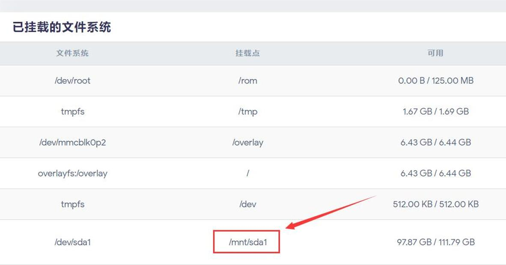
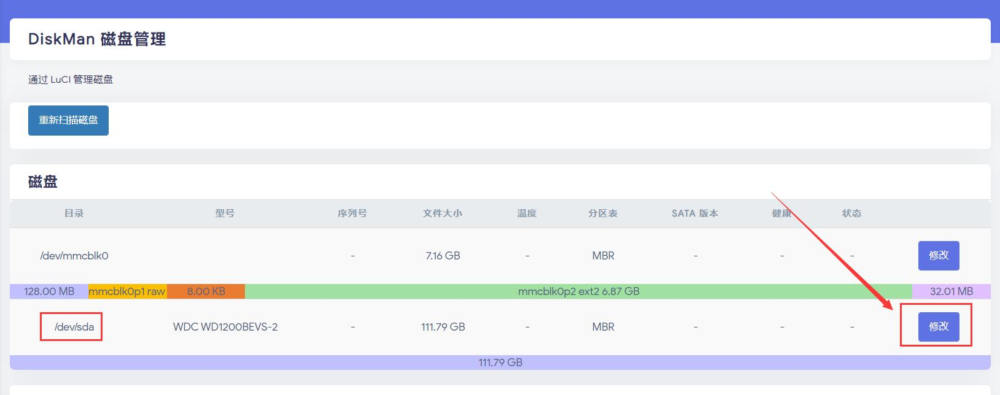
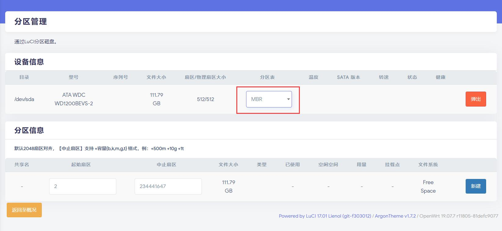
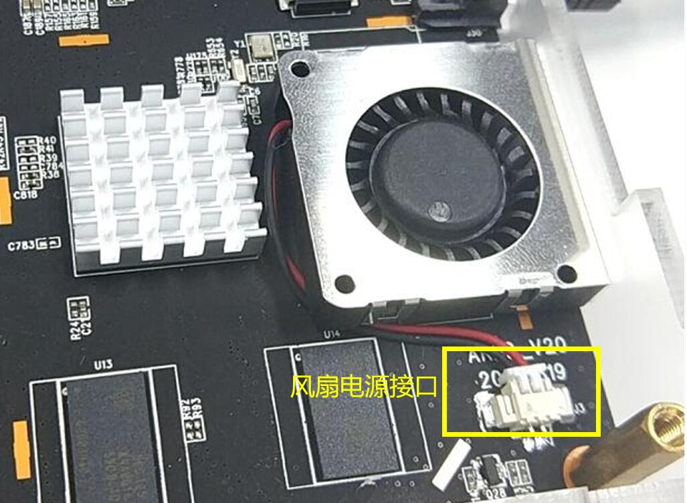
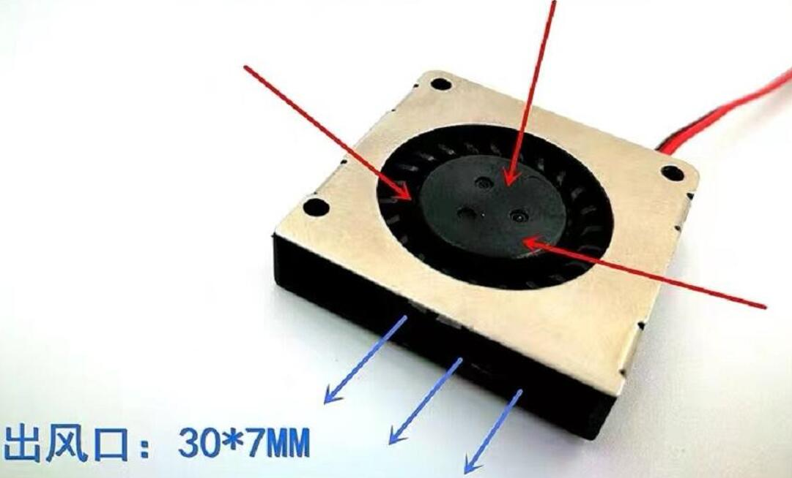

## 挂载硬盘

1.首先在ARS2上接上SATA硬盘；

2.开机后，进入管理界面，打开系统——磁盘管理；

**A：如果是已经是NTFS或者ext4格式的硬盘，开机就自动挂载了，在磁盘管理和挂载点，能看到硬盘，可以直接使用。**

* 如果是USB接口的移动硬盘/U盘或者硬盘仓，直接接上ARS2的USB口，就能用。




**B：如果是新硬盘：**

* 磁盘管理会发现一块空盘，点击空盘右边的“修改”按钮；



* 先修改分区表，改成GPT，提示覆盖提示，点击确定；



* 然后下方分区信息，点击新建就会出现盘符；


* 然后点击格式化，选择磁盘格式(推荐ext4或者NTFS)，然后格式化，就创建好硬盘了；


* 格式化完成后返回，新盘已经创建完成。建议重启下机器，就可以使用硬盘了。


3.硬盘的选择：

* SATA接口硬盘，一般常见希捷、西数等品牌的2SATA接口硬盘，一般常见希捷、西数等品牌的2.5寸、3.5寸都成；

* M.2 SATA硬盘可以考虑：“三星SSD固态硬盘M.2接口(SATA总线)860EVO系列”或者“金士顿SSD固态硬盘M.2接口(SATA总线)A400系列”。


## 变身NAS

EasePi默认系统已经内置易有云(NAS插件)存储端，还有配套的APP和PC客户端。

1.首先在EasePi上安装硬盘，SATA接口或者M.2 SATA接口，或者移动硬盘都成。然后在EasePi管理界面，打开系统——挂载点，挂载好硬盘。


2.打开易有云插件，按照[易有云绑定教程](https://doc.linkease.com/zh/guide/linkease_storage/bind.html)设置完成即可。


3.点击[易有云客户端下载](https://doc.linkease.com/downloads/)，下载易有云各种客户端，畅快体验NAS。

4.[易有云手机端玩法](https://doc.linkease.com/zh/guide/linkease_app/tutorial.html)和[易有云PC端玩法](https://doc.linkease.com/zh/guide/linkease_app/pc.html)，详细的介绍了如何玩转易有云。


## 远程穿透

 * EasePi默认系统已经内置DDNSTO远程穿透插件，按照[DDNSTO获取Token](https://doc.linkease.com/zh/guide/ddnsto/koolshare_merlin.html#获取token)，然后[设置穿透](https://doc.linkease.com/zh/guide/ddnsto/koolshare_merlin.html#穿透设置)，配置完成即可。

 * 当然DDNSTO还有更多很好玩的教程。[DDNSTO玩转远程应用中心](https://doc.linkease.com/zh/guide/ddnsto/cloudapp.html)及[更多玩法](https://doc.linkease.com/zh/guide/ddnsto/scene.html)。

 


## 更新固件

 * 进入EasePi的管理界面，打开系统——备份升级，刷写新固件，选择EasePi的定制固件即可刷入。

 * PS：若刷入第三方定制的固件，或者当前系统出错时，刷入新固件时不要保存配置。

 * [官方固件](https://fw.koolcenter.com/binary/ars2/) -->


## Samba共享

ARS2上挂载了硬盘，然后通过Samba协议共享出去，在局域网内的其他设备可以通过Samba协议访问。

1.进入管理界面，打开系统——挂载点，找到硬盘的挂载点：

比如教程演示的硬盘挂载点：/mnt/sda1


2.打开服务——网络共享，勾选已启动，主机名随意(如ARS2)，然后共享目录，点击添加：

```
共享名：随意，可根据盘符来，比如sda1

目录：硬盘的挂载点，/mnt/sda1

可浏览：勾选

只读：别勾选，勾选后，不能写入数据

强制ROOT：勾选

允许用户：root，Openwrt默认系统用户

允许匿名用户：勾选

仅来宾用户和继承所有者：不勾选

创建权限掩码和目录权限掩码：0777

```


3.上面设置好以后，保存应用。然后就可以通过局域网内其他设备访问了，比如电脑：

打开电脑的资源管理器，输入：

```
\\192.168.2.100
```
ps：演示机ARS2的IP是192.168.2.100，根据实际情况填写IP。


然后回车就看到samba共享出来的硬盘sda了。


## LED灯控制

LED指示灯控制，可以关闭灯光。

* 进入管理界面，打开系统——LED配置——添加：

```
共享名：随意；

LED名称：选择灯，red 红灯，green 绿灯；

默认状态：不勾选；

触发器：选择oneshot。
```

* 如下图保存应用，即可关闭绿灯。


## 加装风扇

一些小伙伴对温度有要求，需要加装风扇，我们是预留了风扇电源接口的。



1.购买风扇：

建议风扇体积，30x30x7mm，如图这种涡轮小风扇(注意电源接口是1.25端子)，将机器内部热量吹出去。

不恰饭推荐：[图中风扇连接](https://m.tb.cn/h.f4unOTi?sm=ef253c)，5v的就成，电源接口是1.25端子(直接发图给客服)。网购平台很多，搜索关键字“3007涡轮”。




2.安装风扇：

将风扇用双面胶贴在如图位置，风口向外，插好电源。通电后就能将机器内部的热空气吹到外面。


## 救援模式

* 救援模式与主系统独立，不会因为正常的刷机或者主系统配置错误而失效。

* 由于救援模式运行在内存盘里，除了刷机，重置，导入配置等操作外，都不会影响到主系统，并且所有配置都不会保留。

* 适合操作错误导致系统进不去的伙伴来“救砖”。


#### A.进入救援模式

1.断电状态下，按住开机键再通电，当红灯亮起时松开开机键，即可进入救援模式。

2.救援模式启动完毕以后，绿灯会常亮，红灯为心跳模式。

3.电脑网线连接ARS2的LAN口，浏览器http://192.168.100.1进入救援模式(确认电脑是自动获取IP)。


#### B.救援模式使用

1.救援模式的WAN口是DHCP客户端，LAN口是DHCP服务端，LAN网段是192.168.100.1/24，救援模式下防火墙不可用。

2.救援模式下的操作与正常的OpenWRT大同小异，并集成了LUCI以方便在浏览器中进行操作。

3.在救援模式中可以执行刷机，重置，导入配置等操作，以此恢复主系统的工作状态。(你甚至可以在救援模式中安装软件包。)

