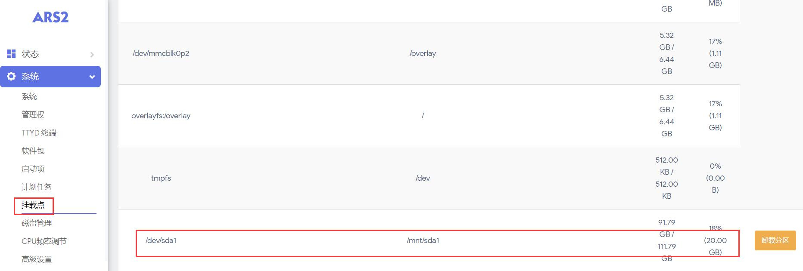
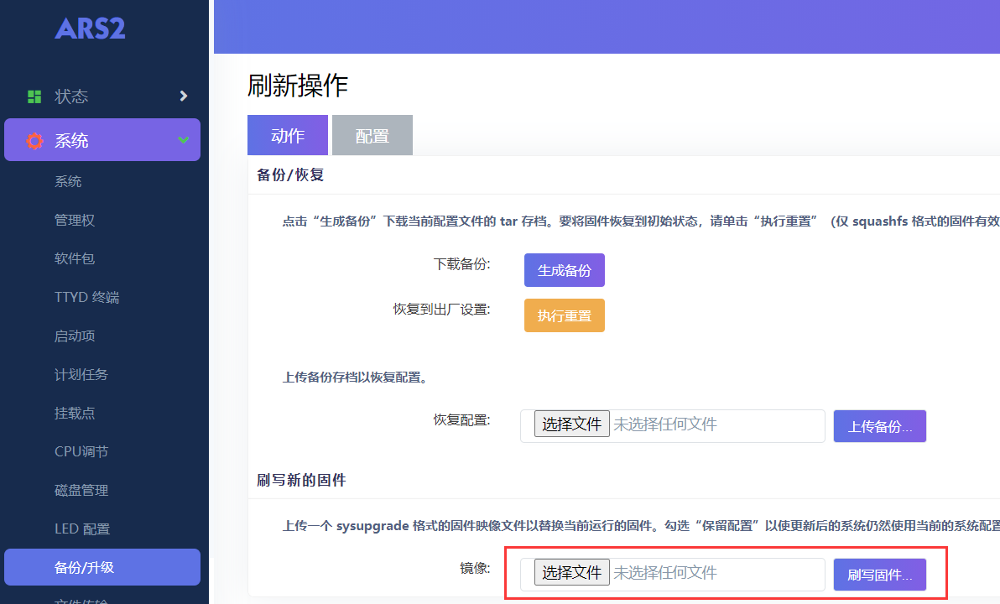
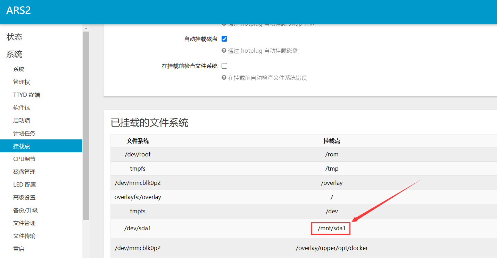
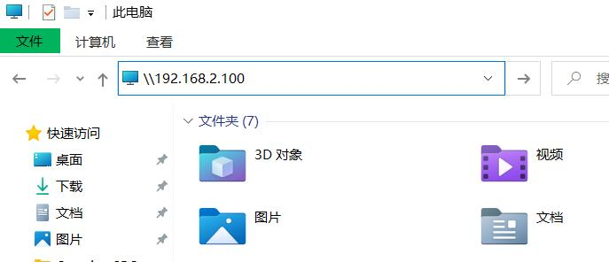
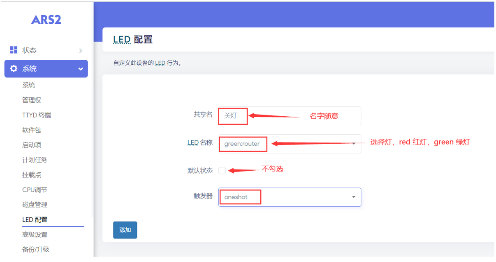

## 变身NAS

EasePi默认系统已经内置易有云(NAS插件)存储端，还有配套的APP和PC客户端。

1.首先在EasePi上安装硬盘，SATA接口或者M.2 SATA接口，或者移动硬盘都成。然后在EasePi管理界面，打开系统——挂载点，挂载好硬盘。



2.打开易有云插件，按照[易有云绑定教程](https://doc.linkease.com/zh/guide/linkease_storage/bind.html)设置完成即可。


3.点击[易有云客户端下载](https://doc.linkease.com/downloads/)，下载易有云各种客户端，畅快体验NAS。

4.[易有云手机端玩法](https://doc.linkease.com/zh/guide/linkease_app/tutorial.html)和[易有云PC端玩法](https://doc.linkease.com/zh/guide/linkease_app/pc.html)，详细的介绍了如何玩转易有云。


## 远程穿透

 * EasePi默认系统已经内置DDNSTO远程穿透插件，按照[DDNSTO获取Token](https://doc.linkease.com/zh/guide/ddnsto/koolshare_merlin.html#获取token)，然后[设置穿透](https://doc.linkease.com/zh/guide/ddnsto/koolshare_merlin.html#穿透设置)，配置完成即可。

 * 当然DDNSTO还有更多很好玩的教程。[DDNSTO玩转远程应用中心](https://doc.linkease.com/zh/guide/ddnsto/cloudapp.html)及[更多玩法](https://doc.linkease.com/zh/guide/ddnsto/scene.html)。

 


## 更新固件

 * 进入EasePi的管理界面，打开系统——备份升级，刷写新固件，选择EasePi的定制固件即可刷入。

 * PS：若刷入第三方定制的固件，或者当前系统出错时，刷入新固件时不要保存配置。

 * [官方固件](https://fw.koolcenter.com/binary/ars2/) -->




## Samba共享

ARS2上挂载了硬盘，然后通过Samba协议共享出去，在局域网内的其他设备可以通过Samba协议访问。

1.进入管理界面，打开系统——挂载点，找到硬盘的挂载点：

比如教程演示的硬盘挂载点：/mnt/sda1



2.打开服务——网络共享，勾选已启动，主机名随意(如ARS2)，然后共享目录，点击添加：

```
共享名：随意，可根据盘符来，比如sda1

目录：硬盘的挂载点，/mnt/sda1

可浏览：勾选

只读：别勾选，勾选后，不能写入数据

强制ROOT：勾选

允许用户：root，Openwrt默认系统用户

允许匿名用户：勾选

仅来宾用户和继承所有者：不勾选

创建权限掩码和目录权限掩码：0777

```


3.上面设置好以后，保存应用。然后就可以通过局域网内其他设备访问了，比如电脑：

打开电脑的资源管理器，输入：

```
\\192.168.2.100
```
ps：演示机ARS2的IP是192.168.2.100，根据实际情况填写IP。



然后回车就看到samba共享出来的硬盘sda了。


## LED灯控制

LED指示灯控制，可以关闭灯光。

* 进入管理界面，打开系统——LED配置——添加：

```
共享名：随意；

LED名称：选择灯，red 红灯，green 绿灯；

默认状态：不勾选；

触发器：选择oneshot。
```

* 如下图保存应用，即可关闭绿灯。




