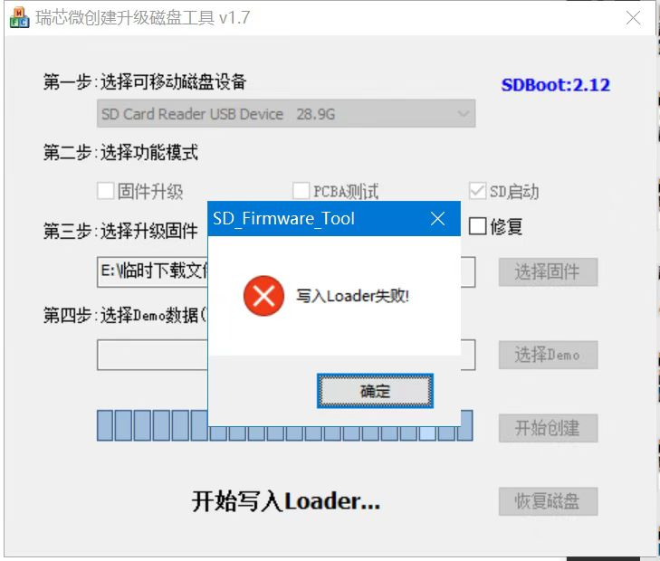
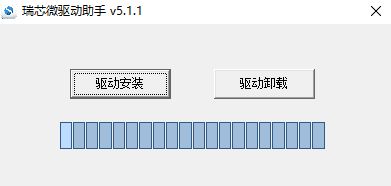
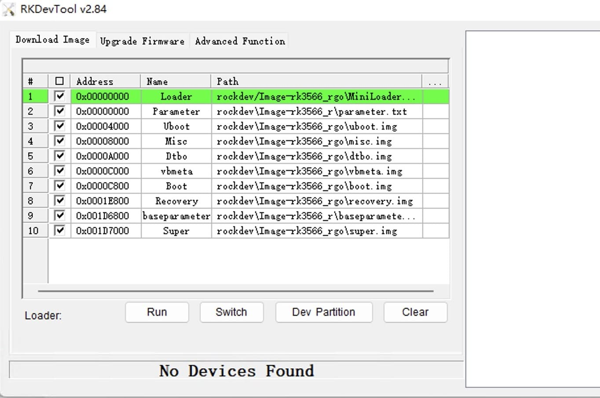
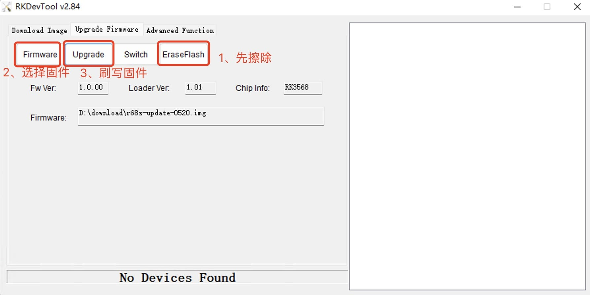

## EasePi ARS2

[EasePi ARS2](https://doc.linkease.com/zh/guide/easepi/)

## X86 物理机

### 视频介绍

<iframe src="//player.bilibili.com/player.html?aid=811882019&bvid=BV1p34y1j7Jw&cid=729311389&page=1" scrolling="no" border="0" frameborder="no" framespacing="0" allowfullscreen="true"> </iframe>

### 准备：

1. 一个 USB
2. 一个显示器
3. 一个键盘
4. 还需要一台 windows 电脑

### 下载最新的固件

* [固件下载](https://fw.koolcenter.com/iStoreOS/x86_64/)
* [固件下载-EFI](https://fw.koolcenter.com/iStoreOS/x86_64/)

越后面的版本越新，下载最新的版本。下载完成之后不需要解压。

### 用 rufus 做 USB 启动盘 

[Rufus下载](https://rufus.ie/zh/)

插入 USB，选择 下载好的固件

### 把 USB 启动盘，跟键盘，跟显示器接入 X86 机器

选择从 USB 启动。一般按 F11 ，选择接入的 USB，就可以启动。
如果找不到 USB，那么可能你的 USB 不兼容，需要换一个 USB

### 把固件从 USB 安装到系统

登录系统，登录成功之后，输入：

quickstart

或者 qu + tab 自动补全

选择 Install X86，一直按确定，就行了。具体如下图所示：

### 用 Show Interfaces 查看网线插入到了哪个网口

以及查看当前 LAN 口的 IP

## R2S 设备

### 准备：

1. 一个 USB 读卡器
2. 一张 TF 卡
3. 还需要一台 windows 电脑

### 下载最新的固件

* [固件下载](https://fw.koolcenter.com/iStoreOS/r2s/)

越后面的版本越新，下载最新的版本。下载完成之后不需要解压。

### 用 rufus 将固件刷入 TF卡

[Rufus下载](https://rufus.ie/zh/)

### 将 TF 卡插入 R2S 设备卡槽后接通电源即可

## R4S 设备

同 R2S，固件下载地址不一样，请从[这里](https://fw.koolcenter.com/iStoreOS/r4s/)下载

（注意，目前 R4S 仅支持 4G 内存版本，暂时不支持 1G 内存版本）

## R5S 设备

### 方法一：

同 R2S，用 rufus 写入固件到 TF 卡启动。必须下载 r5s-sdcard-xxxx.img.gz 这样格式的文件。固件下载地址不一样，请从 [这里](https://fw.koolcenter.com/iStoreOS/r5s/)下载

### 方法二：

用瑞芯威升级磁盘工具来刷写固件。工具很小，具体跟上面的方法一样，但是这个方法可以写入 eMMC 启动。

首先下载[瑞芯威升级磁盘工具](https://fw.koolcenter.com/iStoreOS/alpha/SDDiskTool_v1.7.zip)

解压并运行，如图所示

1. 选择你的 TF 卡读卡器
2. 选择固件
3. 选择从 ”SD启动”

开始创建。如果创建提示错误，可以直接再重新创建一次，如图所示：

## R68S 设备

使用USB线缆刷写固件

### 准备

1. 一条 USB公对公数据线

2. 还需要一台 windows 电脑

### 下载最新的固件

* [固件下载](https://fw.koolcenter.com/iStoreOS/alpha/)

越后面的版本越新，下载最新的版本。下载完成之后不需要解压。

### 使用 RKDevTool 工具刷入固件

1. 安装RK USB驱动，
下载 [安装RK USB驱动](https://download.t-firefly.com/product/Board/RK356X/Tool/Window/DriverAssitant/DriverAssitant_v5.1.1.zip)，解压，然后运行里面的 DriverInstall.exe 。为了所有设备都使用更新的驱动，请先选择驱动卸载，然后再选择驱动安装。

2. 运行RKDevTool.exe，
下载 [RKDevTool](https://download.t-firefly.com/product/Board/RK356X/Tool/Window/AndroidTool/RKDevTool_Release_v2.84.zip)
解压，运行 RKDevTool_Release_v2.xx 目录里面的 RKDevTool.exe（注意，如果是 Windows 7/8,需要按鼠标右键，选择以管理员身份运行）。

3. 按住设备上的 RECOVERY （恢复）键并保持

4. USB 数据线一端连接 windows 电脑，一端连接开发板

5. 大约几秒钟后，松开 RECOVERY 键

6. RKDevTool上即可发现这个设备

然后切换到 Upgrade Firmware，首先点击 EraseFlash 擦除Flash，再点击 Firmware 选择固件，最后点击 Upgrade 刷写固件即可

