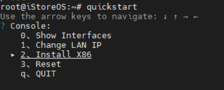

## EasePi ARS2

[EasePi ARS2](https://doc.linkease.com/zh/guide/easepi/)

## X86 物理机

### 视频介绍

<iframe src="//player.bilibili.com/player.html?aid=811882019&bvid=BV1p34y1j7Jw&cid=729311389&page=1" scrolling="no" border="0" frameborder="no" framespacing="0" allowfullscreen="true"> </iframe>

### 准备：

1. 一个 USB
2. 一个显示器
3. 一个键盘
4. 还需要一台 windows 电脑

### 下载最新的固件

* [固件下载](https://fw.koolcenter.com/iStoreOS/x86_64/)
* [固件下载-EFI](https://fw.koolcenter.com/iStoreOS/x86_64/)

越后面的版本越新，下载最新的版本。下载完成之后不需要解压。

### 用 rufus 做 USB 启动盘 

[Rufus下载](https://rufus.ie/zh/)

插入 USB，选择 下载好的固件

### 把 USB 启动盘，跟键盘，跟显示器接入 X86 机器

选择从 USB 启动。一般按 F11 ，选择接入的 USB，就可以启动。
如果找不到 USB，那么可能你的 USB 不兼容，需要换一个 USB

### 把固件从 USB 安装到系统

登录系统，登录成功之后，输入：

quickstart

或者 qu + tab 自动补全

选择 Install X86，一直按确定，就行了。具体如下图所示：

### 用 Show Interfaces 查看网线插入到了哪个网口

以及查看当前 LAN 口的 IP

## R2S 设备

### 开始安装

1、安装前的准备

## R4S 设备

### 开始安装

1、安装前的准备