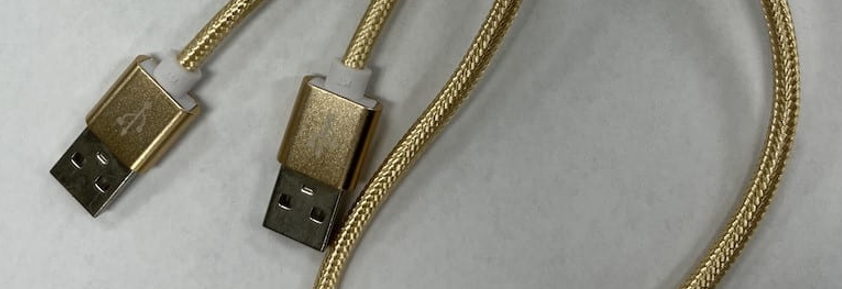
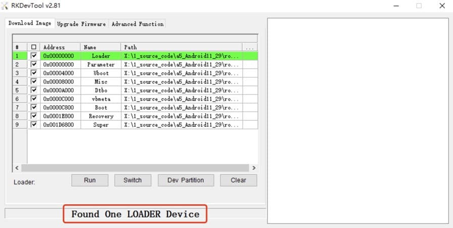

## EasePi ARS2

[EasePi ARS2](https://doc.linkease.com/zh/guide/easepi/)

## X86 物理机

X86物理机，范围很广，可以是各种"电脑"，或者J4125/N5105等小主机。

### 1.视频介绍

<iframe src="//player.bilibili.com/player.html?aid=811882019&bvid=BV1p34y1j7Jw&cid=729311389&page=1" scrolling="no" border="0" frameborder="no" framespacing="0" allowfullscreen="true"> </iframe>

### 2.准备工作

* 一个 U盘
* 一个显示器
* 一个键盘
* 一台 windows 电脑

### 3.下载固件

* [固件下载](https://fw.koolcenter.com/iStoreOS/x86_64/)
* [固件下载-EFI](https://fw.koolcenter.com/iStoreOS/x86_64/)

越后面的版本越新，下载最新的版本。下载完成之后不需要解压。

### 4.做启动盘

* 电脑上用 rufus 做 USB 启动盘 

[Rufus下载](https://rufus.ie/zh/)

* 电脑插入U盘，打开rufus工具，选择下载好的固件，把固件写入到U盘

* 把 U盘/键盘/显示器 接入X86机器

选择从U盘启动，一般按 F11 (x86机器太多，范围太广，可能不一定所有的机器都是F11快捷启动，具体自行查看)，选择接入的U盘，就可以启动。

如果找不到U盘，那么可能你的U盘不兼容，需要换一个U盘。

* 把固件从U盘安装到系统

登录U盘系统，登录成功之后，输入：

`quickstart` (或者 qu + tab 自动补全)

选择 Install X86，一直按确定，就行了。具体如下图所示：

* 用 `Show Interfaces` 查看网线插入到了哪个网口，以及查看当前LAN口的IP

### 5.启动系统

系统写入完成后，拔掉外接设备(U盘/键盘等)，通电启动。

## R2S/R4S 设备

友善电子nanopi-R2s/R4s。两款机器，刷入固件方法一样，固件不一样而已。

* 注意，目前 R4S 固件仅支持 4G 内存版本，暂时不支持 1G 内存版本。

### 1.准备工作

* 一个 USB TF读卡器
* 一张 TF 卡
* 一台 windows 电脑

### 2.下载固件

* [R2s固件下载](https://fw.koolcenter.com/iStoreOS/r2s/)

* [R4s固件下载](https://fw.koolcenter.com/iStoreOS/r4s/)

越后面的版本越新，下载最新的版本。下载完成之后不需要解压。

### 3.做启动盘

* 电脑上用 rufus 将固件写入 TF卡

[Rufus下载](https://rufus.ie/zh/)

* 电脑插入放TF卡的读卡器，打开rufus工具，选择下载好的固件，把固件写入到TF卡

### 4.启动系统

将写入了固件的TF插入到R2s/R4s中，通电启动。

## R68S 设备

电犀牛R68s使用USB线缆刷写固件。

### 1.准备工作

* 一条 USB公对公数据线

* 一台 windows 电脑

### 2.下载固件

* [R68S固件下载](https://fw.koolcenter.com/iStoreOS/alpha/)

越后面的版本越新，下载最新的版本。下载完成之后不需要解压。

### 3.写入固件

* 使用 RKDevTool 工具刷入固件，安装RK USB驱动，
下载 [安装RK USB驱动](https://download.t-firefly.com/product/Board/RK356X/Tool/Window/DriverAssitant/DriverAssitant_v5.1.1.zip)，解压，然后运行里面的 DriverInstall.exe 。为了所有设备都使用更新的驱动，请先选择驱动卸载，然后再选择驱动安装。

* 运行RKDevTool.exe，
下载 [RKDevTool](https://download.t-firefly.com/product/Board/RK356X/Tool/Window/AndroidTool/RKDevTool_Release_v2.84.zip)
解压，运行 RKDevTool_Release_v2.xx 目录里面的 RKDevTool.exe（注意，如果是 Windows 7/8,需要按鼠标右键，选择以管理员身份运行）。

* 按住设备上的 RECOVERY （恢复）键并保持，然后通电， 指示灯变绿色

* USB 数据线一端连接 windows 电脑，一端连接R68s

* 大约几秒钟后，松开 RECOVERY 键

* RKDevTool上即可发现这个设备

然后切换到 Upgrade Firmware，首先点击 EraseFlash 擦除Flash，再点击 Firmware 选择固件，最后点击 Upgrade 刷写固件即可

### 4.启动系统

固件写入完成后，拔掉公头数据线，通电启动。

