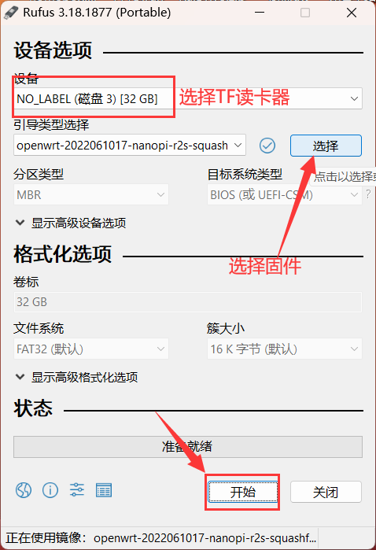

## 树莓派 Model 4

## 1.准备工作

* 一个 USB TF读卡器
* 一张 TF 卡
* 一台 windows 电脑

## 2.下载固件

* 请从 [这里](https://fw.koolcenter.com/iStoreOS/rpi4/)下载固件

越前面版本越新，请注意看中间的日期，比如 xxx20221123xx-xxx.img.gz。下载完成之后不需要解压。

## 3.做启动盘

* 电脑上用 rufus 将固件写入 TF卡

[Rufus下载](https://rufus.ie/zh/)

* 电脑插入放TF卡的读卡器，打开rufus工具，选择下载好的固件，把固件写入到TF卡

## 4.启动系统

将写入了固件的TF插入到树莓派中，通电启动。

### 进入后台管理

* 默认树莓派只有一个网口，这个网口默认为 LAN 口，必须接网线到 LAN 口进行网络配置，改为静态IP的旁路由（设置为旁路由，既可以当路由，也完全不影响独立当一台 NAS 用）
* 默认IP http://192.168.100.1
* 默认用户：root 密码：password

因为只有 LAN 口，则需要用电脑先接到树莓派，再通过旁路由向导设置为静态IP（关闭 DHCP）：

如果不懂的话，就按下面的图片进行配置：（配置完成之后，电脑就没网络了，必须把树莓派接到路由器下面再用新的 IP 链接）

最后建议必读一轮我们的 [FAQ](/zh/guide/istoreos/question.html)，以防后续出现问题知道如何解决！