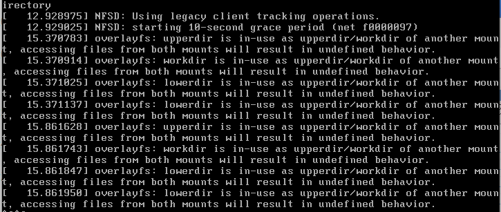
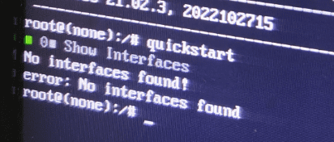
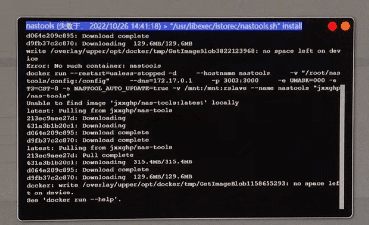
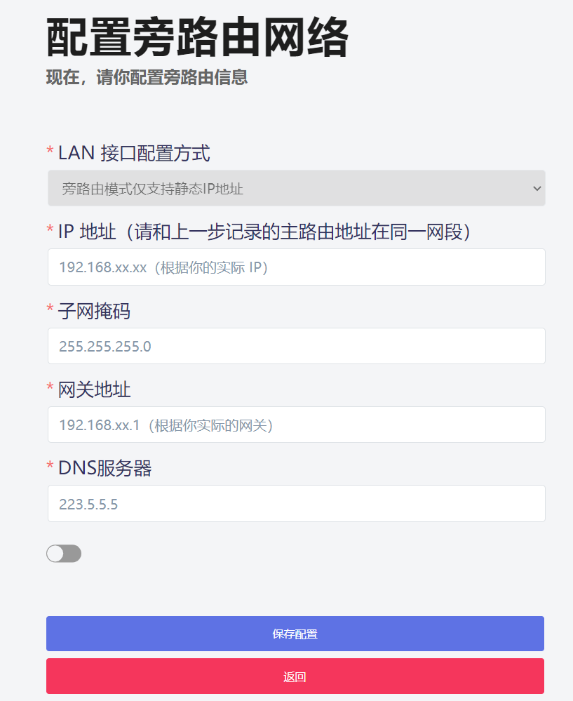
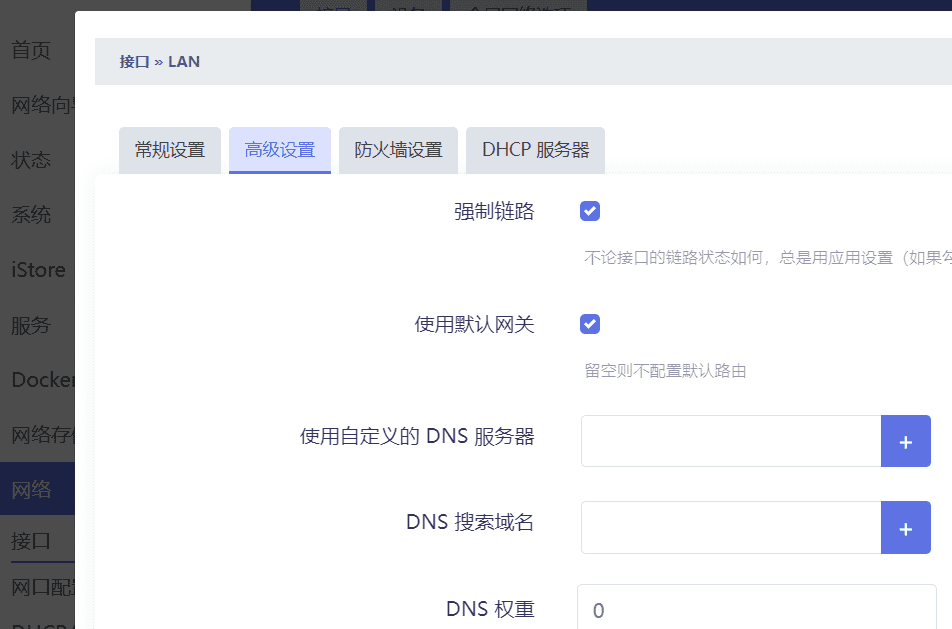
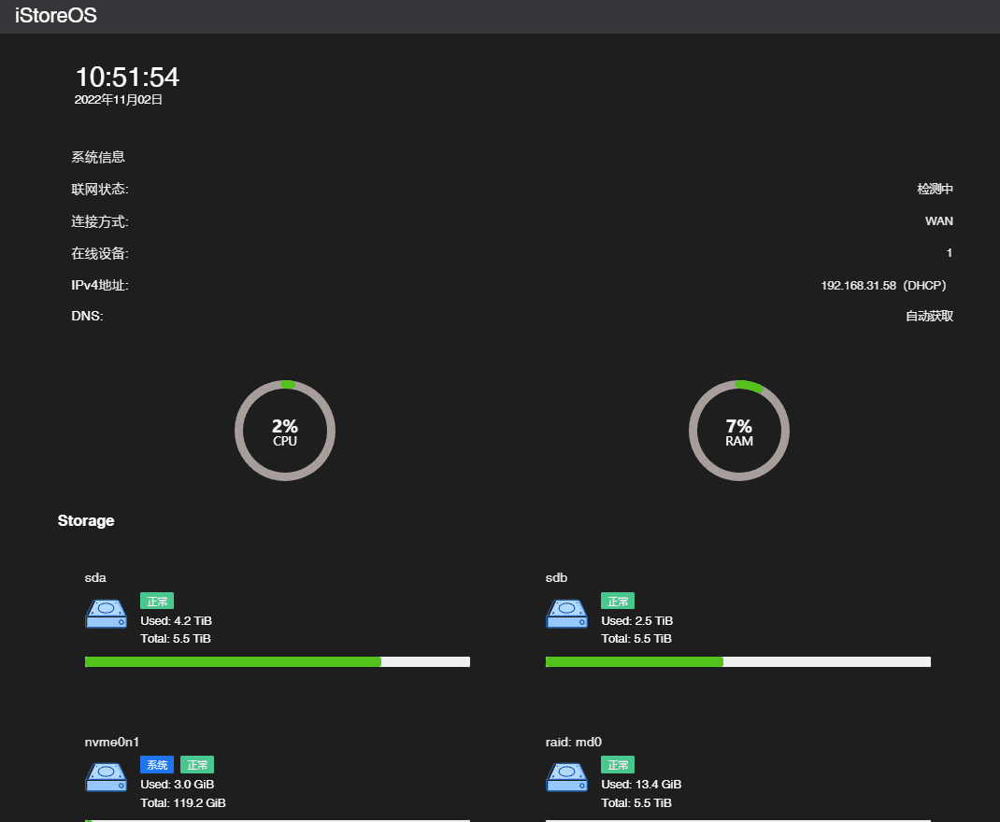

## 最重要的写在最前面

* 如果用 Docker 插件，必须在首页用 Docker 迁移向导，迁移到非根目录的独立的硬盘分区
* 如果喜欢折腾，或者不会卸载手动安装的插件，必须开启沙箱模式。如果安装失败，可以通过沙箱模式回退到上个版本，插件根配置都不丢！
* 不要运行，不要运行，不要运行 opkg install curl。目前官方仓库的 curl 跟我们系统有冲突，是官方的依赖有问题。
* 手动安装插件有依赖错误，则去寻找 .run 的自带依赖的插件包。（记得在沙箱模式下安装，出问题可以回退到上个版本）
* 旁路由设置问题，建议走旁路由设置向导。如果是小米路由器作为主路由，则建议往下读

如果用了上面的方法，几乎不会出现啥问题了。下面是遇到问题之后的解决办法！

## 安装系统

### 刚开始安装显示 Docker Warning



这个警告没事，直接按回车（Enter）就可以进到命令行里面进行进一步的操作了。

是因为它推荐把 Docker 数据独立迁移到非根目录的另外一个硬盘分区。安装完全之后，建议把 Docker 迁移。首页有向导可以迁移。

### 无网卡驱动



说明我们固件很可能没有支持你的网卡的驱动，那么安装失败了。看看是不是下载到了老的固件，或者升级到更新的固件试试？

### 安装系统，提示 root not found

* 可能一，就是系统的硬盘不识别，或者找不到，导致无法从 U 盘继续安装系统。
* 可能二，以前已经安装过系统，U 盘的系统跟系统盘的系统冲突了。需要把系统盘进行檫除掉，比如乱分区成多个分区，再把分区删除，甚至放到 Windows 上清楚硬盘里面的数据。（这个目前我们还在寻找更好的办法）

可以参考其他人的 OpenWRT 的安装教程，必须通过 winpe 来安装试试

### 系统根目录只有 2G，不够需要拓展系统空间

我们系统的设计，是觉得不需要拓展系统空间，你只需要：

1. 用首页向导，把 Docker 迁移到独立的硬盘分区
2. 开启沙箱模式，所以的软件，都会安装到沙箱的硬盘空间，如果软件错误还可以回退。提交之后才会到把增量的存到系统目录。担心根目录不够可以一直不提交到根目录，数据就一直再沙箱空间的分区里。

### 安装软件

### 空间不足导致插件无法安装



因为系统根目录里面的 Docker 没迁移走，或者 Docker 映射的目录设置到了 /root 下面，或者易有云的初始目录到 /root 下面

* Docker 要迁移到一个独立的硬盘分区。首页有迁移向导。
* 如果其它插件把数据目录放到了根目录，则需要停止这个插件，再删除，再重新配置
* 如果没有把易有云的初始目录配置到硬盘上，需要删除易有云重新配置

### 插件安装失败，提示 curl 错误

错误如下：

```
Downloading https://mirrors.tuna.tsinghua.edu.cn/openwrt/releases/21.02.3/packages/x86_64/telephony/Packages.gz
Error loading shared library libwolfssl.so.5.5.1.99a5b54a: No such file or directory (needed by /usr/bin/curl)
Error relocating /usr/bin/curl: curl_easy_header: symbol not found
Error relocating /usr/bin/curl: curl_easy_nextheader: symbol not found
*** Failed to download the package list from https://mirrors.tuna.tsinghua.edu.cn/openwrt/releases/21.02.3/packages/x86_64/telephony/Packages.gz
```

iStoreOS 跟随官方的 OpenWRT Master 分支，有 BUG，如果你运行了：opkg install curl 就会触发这个 BUG。解决办法：

* opkg udpate ; opkg install libcurl
* 如果上面方法不行，则下载：[reset_rom_pkgs](https://github.com/linkease/openwrt-app-actions/blob/main/applications/luci-app-systools/root/usr/share/systools/reset_rom_pkgs.run) 在手动安装，再重启。如果下载不了可以加 QQ 群文件下载
* 或者如果已经有了 Systools 插件，可以在 Systools 插件里面运行 reset_rom_pkgs

### 插件安装提供 DNS 错误


* 可能你的旁路由，或者路由器里面 DNS 配置错误。可以在首页手动设置 DNS，可以从这里选择：223.5.5.5 223.6.6.6 114.114.114.114
* 可能你的旁路由的使用默认网关没打勾，具体可以网络里面的“旁路由”
* 可能你的旁路由里面本身没网络，或者局域网里面有两个以上的 DHCP 服务器（多个路由器的 LAN 口接到网络里），导致 dnsmasq 没启动，所以无法进行 DNS 解析。这个可以看系统日志，确认是否有多个 DHCP 服务器的错误提示。

### 首页提示软件源错误

* 参考上文 curl 错误，需要手动运行 reset_rom_pkgs 恢复被修改的系统包
* DNS 解析走了 IPv6，导致出现一些问题，可以安装 Systools 系统便利工具，关闭 IPv6
* 可能路由器的内部的网络走了国外线路，而且网络不稳定，所以有时候会出现软件源错误。可以忽略。

## 网络

### 只有一个 LAN 口的时候，只能走旁路由配置向导，设置为固定 IP

比如用的是树莓派等设备，如果只有 LAN 口，则需要用电脑先接到旁路由，再通过向导只能配置为旁路由形态。

如果不懂的话，就按下面的图片进行配置：（配置完成之后，电脑就没网络了，必须把树莓派接到路由器下面再用新的 IP 链接）



### 旁路由设置完成之后，下面的设备无法上网

首先推荐走旁路由设置向导，出问题的概率就很低了。如果出现这样的问题，可能性一：



"网络" -> "接口" -> "LAN" 使用默认网关确保打勾。

可能行二，你使用的小米等的主路由导致的问题，尝试解决：


"网络" -> "防火墙" -> "区域里面的LAN" 把 "IP 动态伪装"	打勾

### 软件更新之后，界面错乱



浏览器缓存问题。可以尝试 ctrl + F5 强制刷新，如果还不行，可以 F12 进到弹出来的菜单：

"网络" -> "停用缓存" 打勾，之后再刷新网页。好了之后，再按 F12 关闭窗口。

如果是很老的浏览器，考虑切换到 chrome 浏览器试试

### 阿里云盘或者 Jellyfin 等插件导致内测 100% 或者 CPU 居高不下

首页进到终端，用 top 等相关的命令自行排查

## 网络向导

### Merlin 跟 iStoreOS 的旁路由设置

视频教程：[iStoreOS 旁路由](https://www.bilibili.com/video/BV1pY411N7fX)。

### 旁路由 DHCP 设置

如果主路由打开 DHCP，则需要把 DHCP 的网关改成旁路由的网关。要不就关闭主路由 DHCP，打开旁路由 DHCP。一个局域网不能同时存在两个DHCP。

### ARS2 作为主路由，如果要让无线路由器底下的设备跟 ARS2 一个局域网

需要把无线路由器设置为 AP 模式

### 如果是 Mesh 路由器，比如 AIMesh，或者 Orbi，可以把 AIMesh 工作在 AP 模式，AiMesh 依然有效

### Orbi 跟 iStoreOS 的组网教程

TODO

## 其它

### 我们没有违反任何协议

iStoreOS 目标做个国内外都合法的固件，这样企业才能更安全的使用 iStoreOS。代码开源地址：[iStoreOS](https://github.com/istoreos/istoreos)

我们努力做到这一点，如果觉得有任何疑问，可以到官方咨询或者告知我们。

### iStoreOS 没进行魔改

完全兼容官方仓库，也就是 OpenWRT 官方编译的软件包。目前已知的问题是不能安装 curl，会导致冲突，是官方包依赖的问题。
同时把我们的 luci-app-quickstart luci-app-linkease luci-app-ddnsto luci-app-istorex 等插件删除，那么就是接近纯净的 OpenWRT 包。

## 问题自己调试方法

有时候，硬盘掉盘了，或者无法识别某个硬件了，文件共享失败了等等，都可以自行排查下可能出现问题的原因？

* 查看系统日志，在 "状态" -> "系统日志" 里面
* 查看内核日志，在 "状态" -> "内核日志" 里面
* chrome 等浏览器，按 F12 查看弹出的界面的 "控制台"  或者 "网络" 否是出现奇怪的异常

如果实在无法解决，可以考虑：

* "系统" -> "重启"
* 升级到最新版本
* "系统" -> "备份/升级" -> "执行重置"
* 如果有沙箱模式，可以考虑回退到上个版本。（不提交才能回退，提交了就无法回退了，所以要确保系统稳定了再提交）

