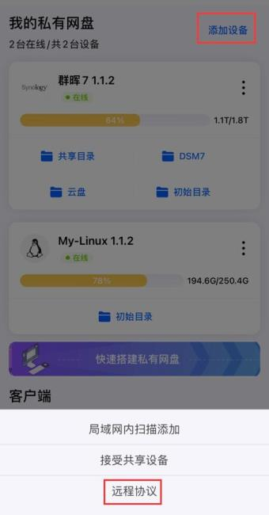
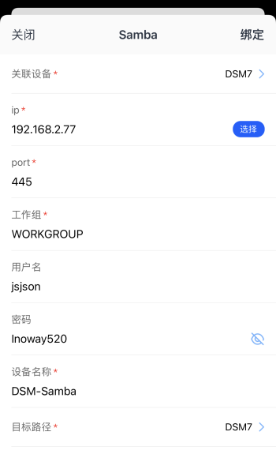
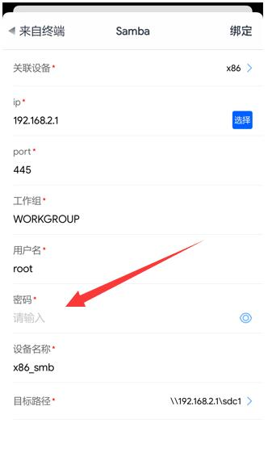
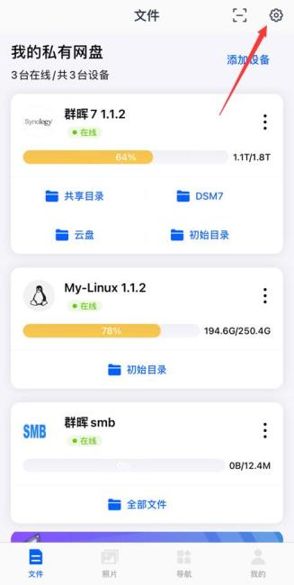
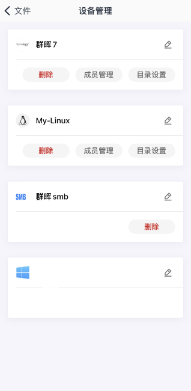

## 远程协议

易有云APP支持多种网络协议(SMB/CIFS、SFTP、WebDAV、S3)的远程访问。

**位于APP首页—标准协议—去添加设备，就会列举很多协议。下面开始一一说明各个协议的简单用法。**




## Samba/CIFS

#### 1.选择“SAMBA”，进入配置界面；



```
关联设备：若选择绑定了易有云的设备，外网都能访问；若不关联设备，仅在设备所在局域网内能访问。

设备IP：开启了Samba协议的设备的IP，可以进入“选择”界面选择，也可以直接输入IP。

port：端口，一般不需要设置，默认即可。

工作组：一般不需要设置，默认即可。

用户名和密码：Samba设备的用户名和密码。

设备名称：可随意设置。

目标路径：选择Samba设备的磁盘。
```

#### 2.添加完成后，就能在“首页”——“我的私有网盘”下面看到刚刚添加的协议图标。

#### 3.若要浏览，点击“全部文件”即可浏览。


## SFTP

#### 1.选择“SFTP”，进入配置界面；


```
关联设备：若选择绑定了易有云的设备，外网都能访问；若不关联设备，仅在设备所在局域网内能访问。

设备IP：开启了SFTP协议的设备的IP，手动输入。

端口：一般不需要设置，默认即可。

设备别称：可随意设置。

用户名称和密码：SFTP设备的用户名和密码。
```

#### 2.添加完成后，就能在“首页”——“我的私有网盘”下面看到刚刚添加的协议图标。

#### 3.若要浏览，点击“全部文件”即可浏览。


## WebDAV

#### 1.选择“WebDAV”，进入配置界面；


```
关联设备：若选择绑定了易有云的设备，外网都能访问；若不关联设备，仅在设备所在局域网内能访问。

服务器url：WebDAV服务器的地址。若不是url，是ip+端口，就如实写，例如：192.168.2.3:6086。

设备别称：可随意设置。

用户名称和密码：WebDAV设置的用户名和密码。
```

* 例如webdav服务是ip+端口形式：


#### 2.添加完成后，就能在“首页”——“我的私有网盘”下面看到刚刚添加的协议图标。

#### 3.若要浏览，点击“全部文件”即可浏览。


## 来自终端

来自终端是个啥？

**就是复制samba、sftp、webdav等特殊协议的配置信息。**

比如：你的账号在手机A1的易有云APP上添加了samba，在手机A2的易有云APP上登录你的账号，可以直接复制手机A1上的samba的配置信息在手机A2上快速配置绑定samba。

**1.进入来自终端，就能发现已经配置好的samba等协议的配置(若设备配置了多个协议，都能看见)；**

**2.点击你需要的协议，然后“启用设备配置信息”，会进入配置界面，只需输入密码后，绑定即可。**




PS：如果在新设备上“删除设备”或者修改，不会影响旧设备，均为本地操作。


## S3

TODO


## 删除协议

绑定的设备或者添加的协议，如何删除呢？

#### 1.App首页右上角齿轮图标进入设备管理界面；



#### 2.绑定的存储端设备和协议设备都会显示出来，要删除哪个直接删除即可。


