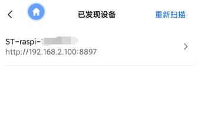

## 网页端绑定教程

易有云存储端安装后第一次打开，需要绑定设备。易有云存储端与客户端一一对应，绑定成功后，每次在存储端登录时，需使用绑定的账号登录。否则，在该存储端的向导页面将无法登录；

**1.在易有云2.0向导页面登录客户端；**

 ①方式一：打开手机易有云，扫描登录二维码登录； 
 ②方式二：输入您所注册的易有云账号密码进行登录；

**2.登录后，进入设备初始设置页面，设置设备名称及初始目录路径；**
* 双击选择路径，可以选择NAS内的目录，也可以选择你的挂载的硬盘目录，这个目录会用来存放易有云的配置文件（不是你分享的数据）。
* 绑定完成后，您可前往“个人空间”查看该初始目录路径下的文件数据。

* 某些特殊Linux发行版Docker安装易有云存储端，自定义了挂载路径，是这样显示的：

**3.操作成功后，即可在易有云2.0客户端使用该账号管理设备文件。**

## APP端绑定教程

管理员如何绑定设备？

* 设备是啥？设备通指安装了易有云存储端的终端设备。[安装存储端](/zh/guide/linkease/install/cloud.md) -->

**1.安装易有云App，注册登录并打开，右上角——“添加设备”——“局域网内扫描添加”，会自动扫描局域网内可绑定设备，点击进行绑定；**

* 绑定设备前提：开启手机WiFi，并确保您的手机与要绑定的设备在同一内网网络下。

**2.发现设备后，点击进入设备初始设置页面；**

**3.进行设备初始设置，设置别名和易有云要绑定的路径(安装目录)，然后确定就绑定成功了。**

**4.首位用户绑定设备后成为该设备的管理员，一个设备只能有一个管理员。**