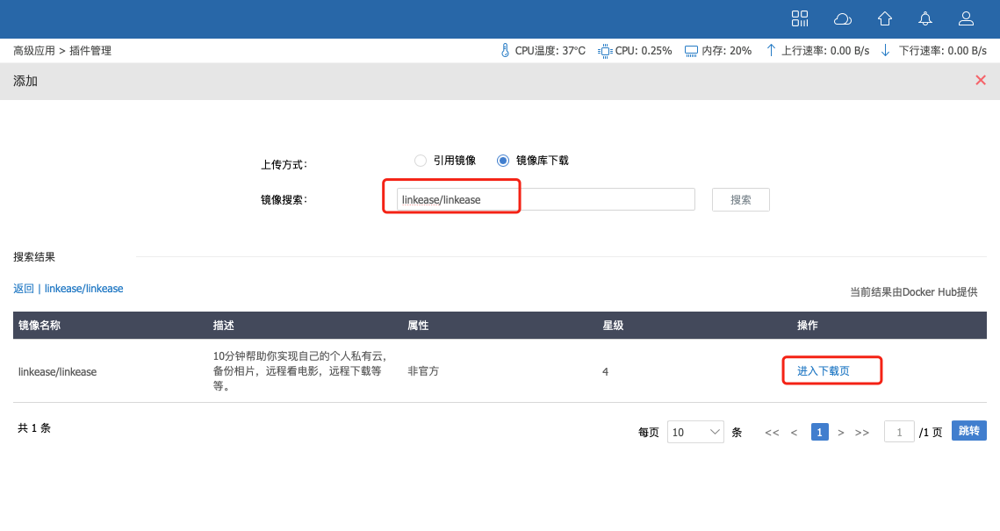
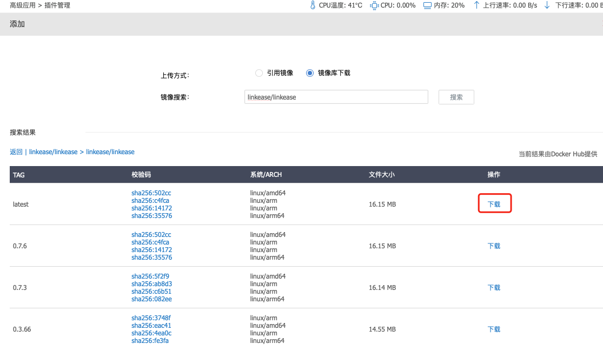
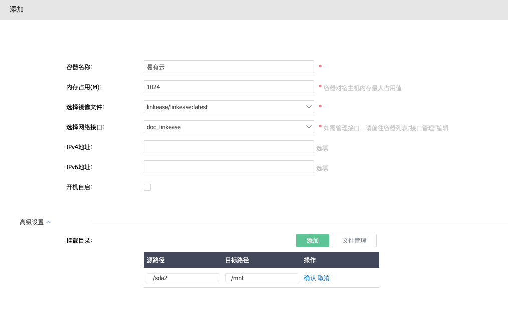
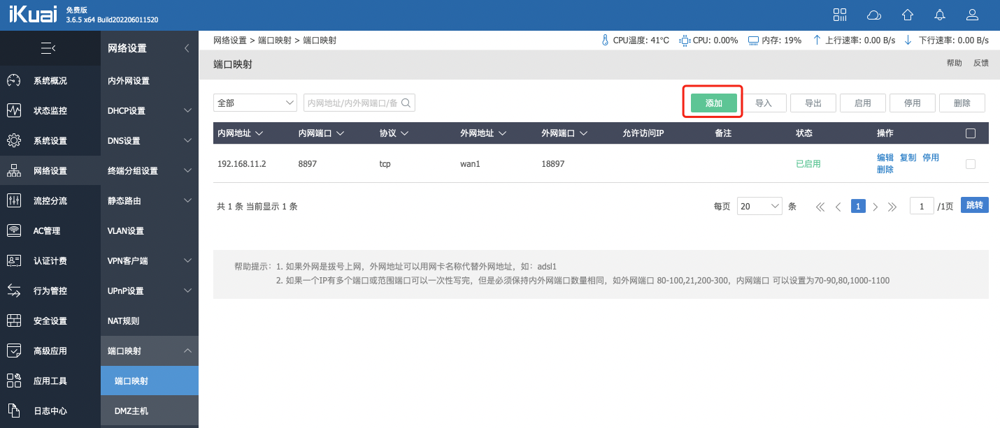
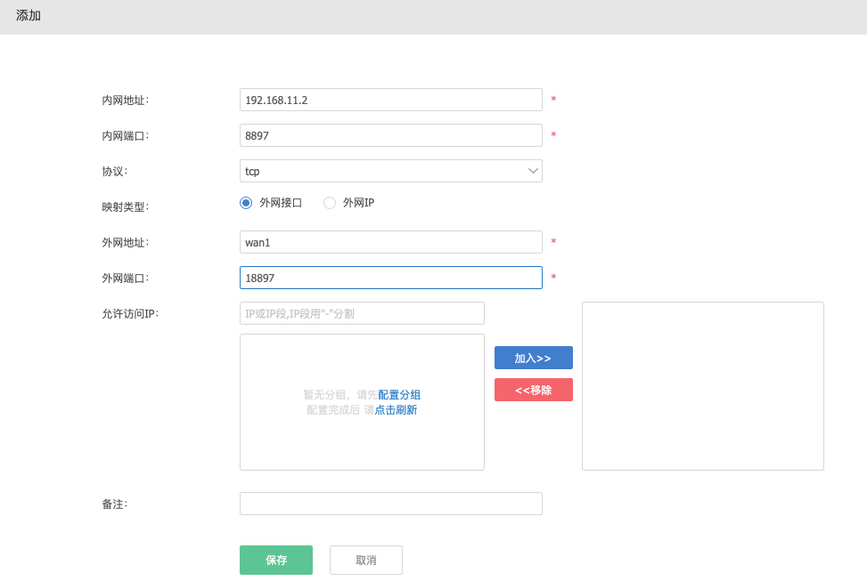

### 爱快

**1.在ikuai后台安装配置好docker。**

  * [ikuai官方docker安装教程](https://bbs.ikuai8.com/thread-121904-1-1.html) -->

**2.通过docker方式安装易有云，首先打开“高级应用-插件管理”的docker。**

**3.点击“镜像管理”，然后点击“添加”。**

**4.上传方式选择“镜像库下载”，然后镜像搜索“linkease/linkease”，在镜像列表选择中点击“进入下载页”，选择第一个最新的点击“下载”后等待下载完成即可。**

**5.回到docker页面容器列表，点击“添加”，填写相关信息后保存后启用**

* 容器名称：给容器设置一个名称。
* 内存占用：给容器设置内存大小，这里可填1024M及以上内存。
* 选择镜像文件：这里选择“linkease/linkease”镜像。
* 选择网络接口：选择在接口管理中创建的网络接口。
* 开启自启：勾选后开机后会自动启动此容器。

高级设置：

* 挂载目录：可将设备系统设置-磁盘管理-文件管理里的文件目录直接挂载到容器里的目录下。在设备文件管理里上传文件，会同步到容器里目标目录下。
源路径填写设备文件管理中目录路径，目标路径填写容器里的目录路径。
这里我选择将我路由器里的挂载路径 “/sda2” 目录挂载到容器里的 “/mnt” 目录下。

**6.配置好后，如何在外网访问容器内的相关服务？**

通过端口映射，去映射容器的ip及需要访问的服务端口，来实现在外网访问容器内相关服务。

打开”网络设置-端口映射“，然后点添加，填入相关参数保存后启用。

* 内网地址：填写容器IP。
* 内网端口：填写容器所使用端口，这里填易有云的默认端口8897。
* 协议：选择容器所使用协议，选择tcp。
* 映射类型：选择外网接口。
* 外网地址：当映射类型选择外网接口外网地址选择有公网IP的外网网口。当映射类型选择外网IP时外网地址填写公网IP地址。
* 外网端口：填写外网访问时所使用端口，可任意填写，这里我任意填18897。

**7.配置好端口映射后第一次打开需要绑定设备。**

比如我刚刚配置的外网端口是18897，所以我们通过打开（http://ikuai设备ip:18897）绑定设备。

**请查看 [存储端绑定教程](/zh/guide/linkease_app/bind.md)。**

**注意事项：**

易有云尽可能使用点对点进行网络传输，建议网络配置使用host网络，不要使用bridge网络(可能造成samba等协议无法访问)。

[镜像地址](https://hub.docker.com/r/linkease/linkease/)

