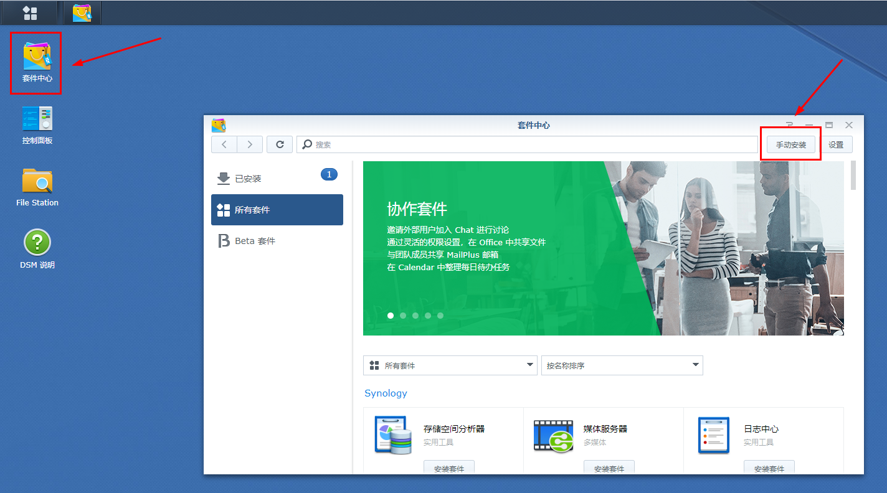
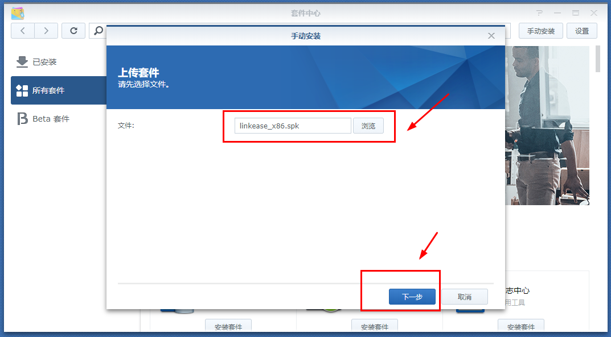
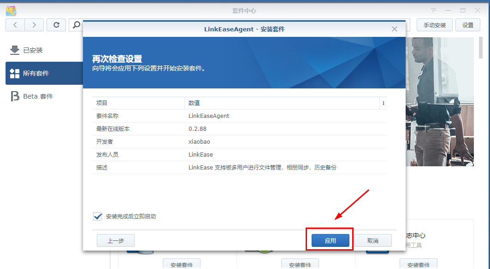
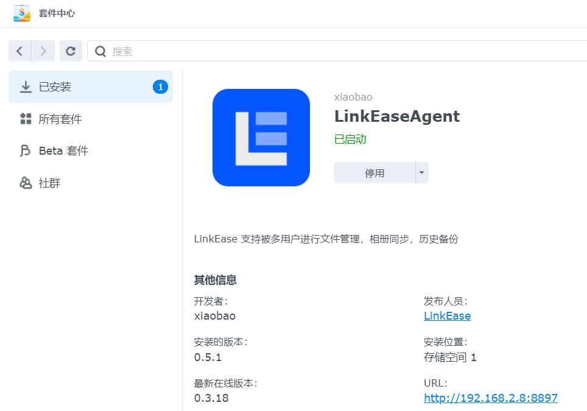
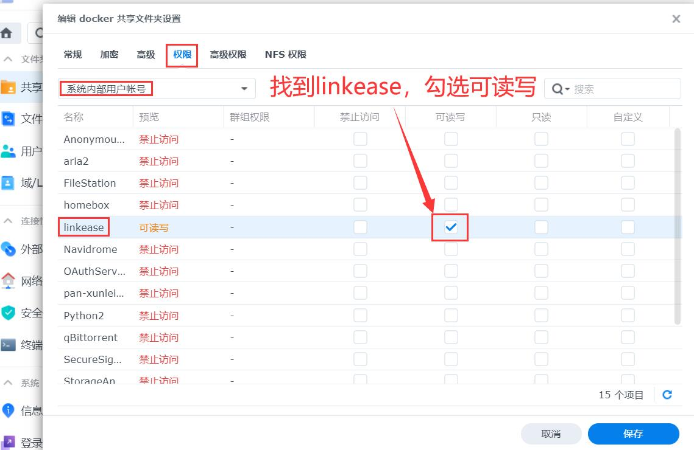

### 群晖

**1.点击“ [存储端下载](https://fw.koolcenter.com/binary/LinkEase/Synology/)”，下载Synology插件，教程示例群晖是x86平台，所以此处选择"X86"；**

<!-- <font color="#ff0000">*请根据自己电脑上的CPU型号选择相对应的存储端</font><br /> -->
* 请根据自己群晖的CPU型号以及DSM版本选择相对应的存储端
* DSM7.x安装或者更新请先卸载旧版本


**2.登录群晖操作系统，点击套件中心，在出现的套件中心弹窗上点击“手动安装”；**



**3.选择已下载的插件上传，按照指示步骤完成插件安装；**






**4.插件安装完成后，进行配置；**

* DSM6.x在“主菜单”点击“易有云”或“易有云设置”均可进入易有云向导页面；


* DSM7.x的设置入口在套件中心—已安装—LinkEaseAgent—点击下方的URL进行配置。



**5.安装后第一次打开，需要绑定设备，请查看 [存储端绑定教程](/zh/guide/linkease_app/bind.md)。**

## 常见问题
#### 注意！由于DSM7.x对权限严格控制，所以额外配置权限(DSM6.x用户无需处理)。有两种方法配置：

- 方法一： 进入“控制面板”—“共享文件夹”, 在目标文件夹上右键选择“编辑”，选择“权限”页签，在页签内用户选择器选择“系统内部用户账户”, 找到“linkease”，勾选“可读写”，最后保存。

ps：目标文件夹：绑定存储端时选中的文件夹或者你易有云想访问的文件夹。




- 方法二：如果有root权限，开启ssh后进入群晖终端，执行以下两条指令：

1.先开启ssh：“控制面板”—“终端机和SNMP”—“启用SSH功能”—应用。


2.登录群晖SSH，终端执行：
```
sudo  sed -i 's/package/root/g' /var/packages/LinkEaseAgent/conf/privilege

sudo /usr/syno/bin/synopkg restart LinkEaseAgent
```
