## 绑定设备

管理员如何绑定设备？

**绑定设备：开启手机WiFi，并确保您的手机与要绑定的设备在同一路由器网络下。**

**1.打开易有云App，系统会自动扫描局域网内可绑定设备，会展示在顶部，点击进行绑定；**


**2.会出现设备，点击进入设备初始设置页面；**


**3.进行设备初始设置，设置别名和易有云要绑定的路径(安装目录)，然后确定就绑定成功了。**

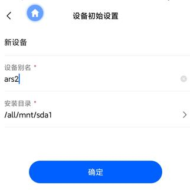

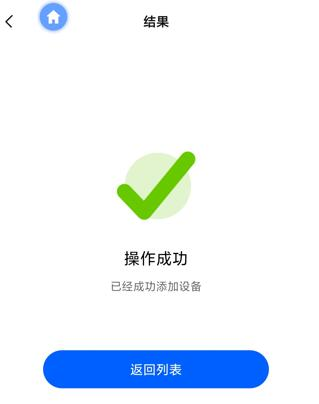


**4.若没自动扫描出新易有云设备，也可以点击首页的“+易有云”按钮，通过扫描绑定或者扫描二维码绑定设备。**

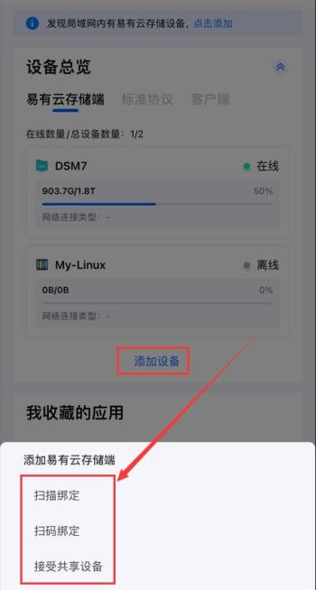


**5.首位用户绑定设备后成为该设备的管理员，一个设备只能有一个管理员。**


## 共享设备

管理员如何共享设备？

**只有管理员才能主动分享设备，每台设备最多可邀请多位成员共享。(目前最多3位，后续敬请期待)**

**1.设备管理员在首页点击右上角的“齿轮”按钮，点击要共享设备的“成员管理”，然后添加成员，输入受邀成员的手机号。**


**2.受邀成员在首页点击“+易有云”按钮，出来弹窗点击“接受共享设备”的消息中接受设备邀请即可共享该设备。**

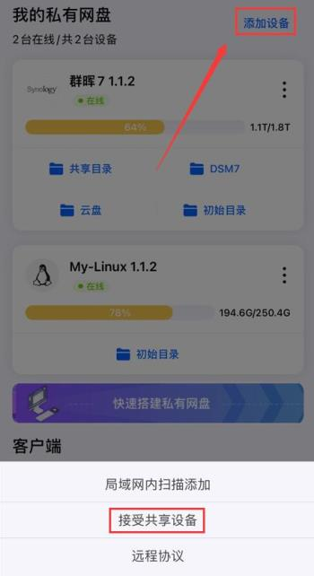


## 取消共享

如何解绑和取消共享？

**易有云APP首页，点击右上角“齿轮”图标，然后点击已共享设备的“成员管理”，然后看到共享的成员，删掉即可。**


<br>***设备删除和取消共享后，将会删除该用户在这台设备上的所有个人空间数据，且无法找回，请谨慎操作！**</br>


## 相册备份

如何备份相册呢？


### iOS客户端

**1.易有云APP打开“我的”，然后点击“照片备份”；**


**2.然后继续点击“照片备份”，出来的弹窗点击“选择目标设备”；**

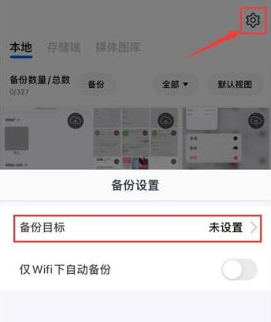

**3.然后选择设备，然后选择目录；**


**4.选好目录后，就能看到一些设置选项；**


**5.设置好就可以点击“立即开始备份”，以后就可以自动备份相册了。**

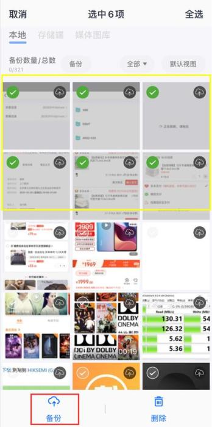


### Android客户端

**1.易有云APP打开“我的”，然后点击“照片备份”；**


**2.打开“相册备份”，然后选择“备份路径”；**

PS：备份路径，右边先选择设备，左边再选择目录。


**3.设置好以后，右上角点击“开始备份”即可。**


## 远程下载

**开始远程下载之前，确保“我的存储”的设备上已经配置好了Aria2。**

**1.易有云APP首页，“我的存储”找到我已经配置好Aria2的设备，点击进入；**


**2.点击“远程下载”；**


**3.若设备上已经配置好，会自动确认。若提示“无法获取Aria2配置”，就点击手动设置；**


**4.RPC地址填写：http://127.0.0.1:6800/jsonrpc ，RPC密钥填写：你设备上Aria2的RPC令牌；**


**5.设置完成后，就可以享受远程下载的乐趣了。**


## Jellyfin播放

**易有云App更新，在“设备”里加入了Jellyfin入口，设备上若安装了jellyfin，直接点击可登录播放。**


**1.首先要确定绑定了易有云的设备上，已经安装了Jellyfin；**

* 硬路由不支持安装Jellyfin，软路由(x86、ARM平台)、群晖，Unraid，威联通等NAS可安装。

* Jellyfin不要变更默认8096端口，变了易有云App目前不识别。

* [ARS2设备安装Jellyfin教程](https://doc.linkease.com/zh/guide/easepi/advanced.html#jellyfin硬解) -->

* 其他设备Docker简单安装命令(说明)：[Jellyfin官方教程](https://jellyfin.org/docs/general/administration/installing.html#docker)

/mnt/sda1/jellyfin/config --> Jellyfin的配置路径，按需修改。

/mnt/sda1/media --> Jellyfin媒体库路径，按需修改。

群晖docker安装注意：删除两行路径配置，SSH登录后台，输入“sudo -i”获取临时root权限执行。执行成功后，在Docker中配置路径。

```
docker run -d --name jellyfin \
  --restart unless-stopped \
  --env UID=0 \
  --env GID=0 \
  --env GIDLIST=0 \
  -p 8096:8096 \
  -v /mnt/sda1/jellyfin/config:/config \
  -v /mnt/sda1/media:/media \
  jellyfin/jellyfin
```

**2.设备绑定易有云存储端，然后登录APP，进入“设备”，点击Jellyfin图标即可进入。**


## 远程路由

**易有云App更新，在“设备”里加入了远程路由入口，若在路由器上安装绑定了易有云，点击可登录访问。**


**1.首先确定是路由器(支持OpenWrt、LEDE、梅林等)安装绑定了易有云存储端；**

**2.绑定以后，进入易有云App的“设备”，点击“远程路由”图标即可管理进入路由界面。**


## 视频播放

易有云APP直接播放远端(存储端)的视频：

**1.易有云APP首页，“我的存储”下点存储了视频的设备，点击进入；**


**2.找到视频，点击视频就能播放，若需要加载字幕，字幕和视频放同个文件夹下，会自动加载；**

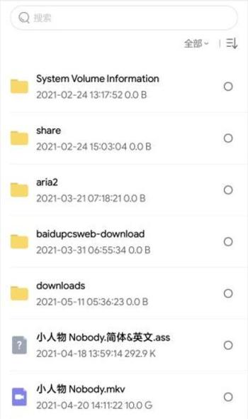

**3.若字幕未自动加载，或者放在别处可以手动选择；**

点击左侧的切换字幕按钮；


可以切换字幕，也可以点击“外挂字幕”，选择未自动加载的字幕。

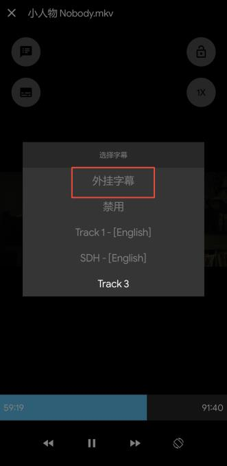


## 微信互传

如何实现文件在微信与易有云之间的互传（iOS）？

### 1.分享

在微信中分享易有云已下载文件

**在操作前，请先在易有云APP里下载需要传输的文件**

**1.在微信聊天窗里点击“+号-文件”；**


**2.在文件目录选择页面，切换并选中“icloud”；**


**3.在出现的页面中，点击左上角“浏览”，然后点击“我的iPhone”，并点击进入易有云Lite文件列表页面；**


**4.在易有云Lite里的download文件夹中选中要分享的文件后即可分享文件给微信群/好友。**

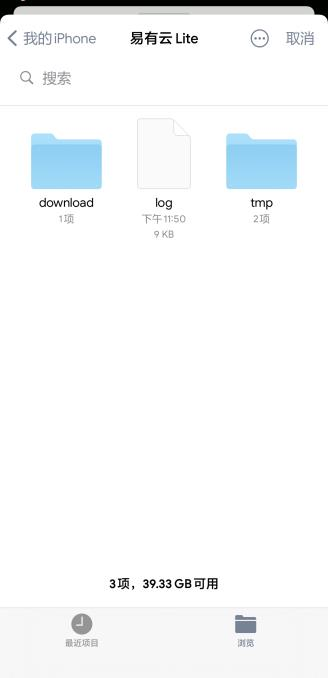


### 2.上传

把微信文件上传至易有云云端保存

*此方式限制文件大小不得超过100M（微信本身限制）

**1.在微信中打开要上传的文件(文件打开，点击右上角，点击“用其他应用打开”)；**


**2.选择“存储到文件”，然后选择路径保存；**

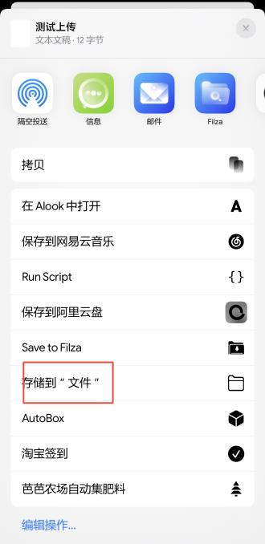

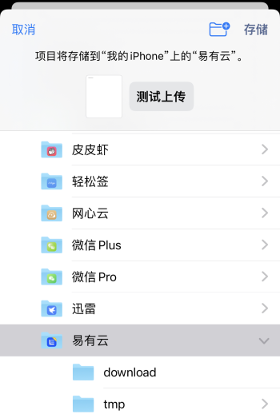

**3.然后打开易有云APP首页，选择“我的存储”的设备；**

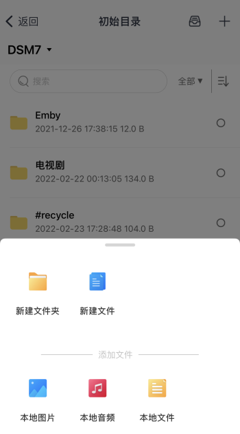

**4.选择要云端保存的设备，打开，选择目录；**

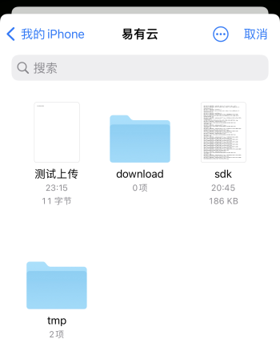

**5.进入目录，点击右上角“+”，选择“本地文件”；**

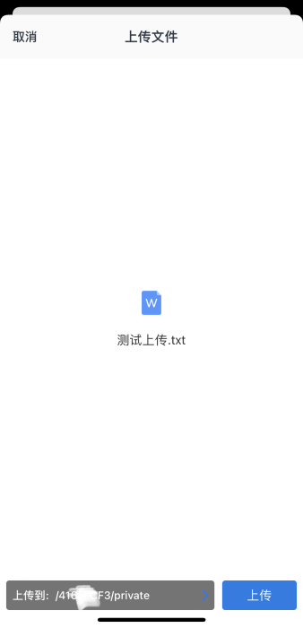

**6.选择之前保存的文件，上传即可，这样文件就保存到云端了。**

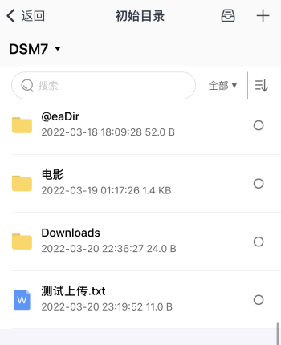


## 协议访问

易有云APP支持多种网络协议(SMB/CIFS、SFTP、WebDAV、S3)访问。

设置位于APP首页—右上角—网络协议，下面开始一一说明各个协议的简单用法。


### Samba/CIFS

#### 1.首先从易有云APP首页—右上角—网络协议，选择“SMB/CIFS”，进入配置界面；


```
关联设备：若选择绑定了易有云的设备，外网都能访问；若不关联设备，仅在设备所在局域网内能访问。

设备IP：开启了Samba协议的设备的IP，可以进入“选择”界面选择，也可以直接输入IP。

port：端口，一般不需要设置，默认即可。

工作组：一般不需要设置，默认即可。

用户名和密码：Samba设备的用户名和密码。

设备名称：可随意设置。

目标路径：选择Samba设备的磁盘。
```

#### 2.回到APP首页，就能看到刚刚添加的协议图标，点击进入即可管理。


### SFTP

#### 1.首先从易有云APP首页—右上角—网络协议，选择“SFTP”，进入配置界面；

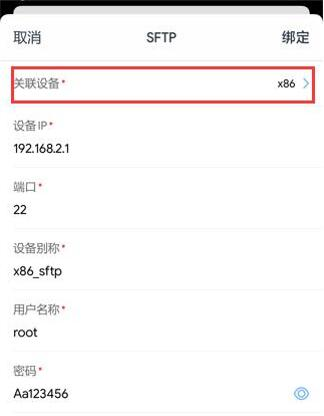

```
关联设备：若选择绑定了易有云的设备，外网都能访问；若不关联设备，仅在设备所在局域网内能访问。

设备IP：开启了SFTP协议的设备的IP，手动输入。

端口：一般不需要设置，默认即可。

设备别称：可随意设置。

用户名称和密码：SFTP设备的用户名和密码。
```

#### 2.回到APP首页，就能看到刚刚添加的协议图标，点击进入即可管理。


### Web DAV

#### 1.首先从易有云APP首页—右上角—网络协议，选择“Web DAV”，进入配置界面；

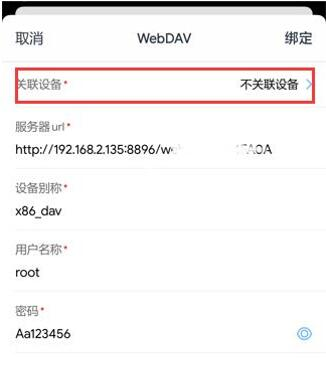

```
关联设备：若选择绑定了易有云的设备，外网都能访问；若不关联设备，仅在设备所在局域网内能访问。

服务器url：WebDAV服务器的地址。若不是url，是ip+端口，就如实写，例如：192.168.2.3:6086。

设备别称：可随意设置。

用户名称和密码：WebDAV设置的用户名和密码。
```

* 例如webdav服务是ip+端口形式：

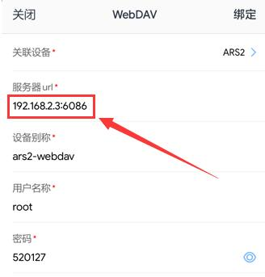

#### 2.回到APP首页，就能看到刚刚添加的协议图标，点击进入即可管理。


### S3

TODO


## 来自终端

来自终端是个啥？

**就是复制samba、sftp、webdav等特殊协议的配置信息。**

比如：你的账号在手机A1的易有云APP上添加了samba，在手机A2的易有云APP上登录你的账号，可以直接复制手机A1上的samba的配置信息在手机A2上快速配置绑定samba。

**1.新设备的易有云APP首页，点击“+网络协议”，出来弹窗选择“来自终端”；**


**2.就能发现旧设备已经配置好的samba等协议的配置(若在旧设备配置了多个协议，都能看见)；**

**点击你需要的协议，然后“启用设备配置信息”，会进入配置界面，只需输入密码后，绑定即可。**

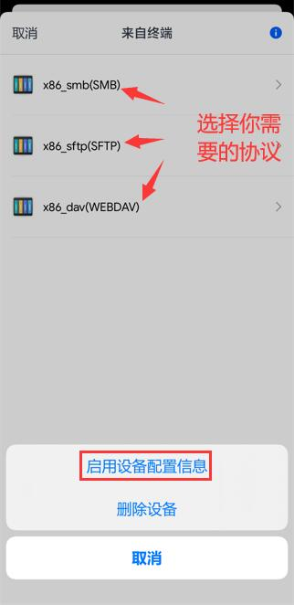


PS：如果在新设备上“删除设备”或者修改，不会影响旧设备，均为本地操作。


## 目录设置

管理员如何设置设备上的目录？

**1.设备管理员点击首页右上角“齿轮”按钮，进入设备管理页面；**


**2.点击设备的“目录设置”，即可进入目录设置页面；**


**3.在此页面可进行目录相关“编辑”，编辑好提交设置即可。**


